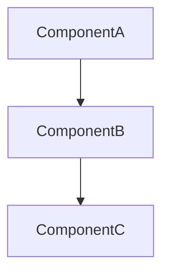
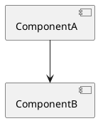

# CLIA - Guia Completo de Desenvolvimento v1.0.0

## Visão Geral do Projeto
CLIA v0.2.3 é uma ferramenta de produtividade para desenvolvedores com **100% de dados reais via MCP (Model Context Protocol)**. Combina capacidades LLM, RAG, análise de segurança, detecção de stack e análise estratégica para workflows de desenvolvimento automatizados. Zero simulações - todos os dados vêm de servidores MCP reais.

## Sistema de Prompts Versionados

O CLIA utiliza um sistema de prompts versionados organizado na estrutura `src/prompts/{comando}/{versão}/`:

```
src/prompts/
├── analyze/1.0.0/system.md
├── ask/1.0.0/
│   ├── doc-analysis-simple.md
│   ├── doc-analysis.md  
│   ├── general.md
│   ├── project-only.md
│   ├── source-analysis.md
│   └── system.md
├── commit/1.0.0/
├── inspect/1.0.0/
├── review/1.0.0/
├── security-scan/1.0.0/
└── stack/1.0.0/
```

Cada comando possui prompts especializados para diferentes contextos e modos de operação, permitindo:
- **Especialização por contexto**: Prompts otimizados para análise de documentação, código-fonte, projetos específicos
- **Evolução controlada**: Versionamento semântico dos prompts
- **Modularidade**: Prompts específicos para diferentes tipos de análise
- **Multilíngue**: Suporte a português e inglês

## Comandos Disponíveis - Documentação Oficial

### comando `analyze`
**Descrição**: Code quality and security analysis with dead code detection v1.0.0
**Uso**: `clia analyze [caminhos...]`
**Alias**: `analyse`
**Argumentos**:
- `[caminhos...]`: Caminhos para análise (padrão: diretório atual)

**Opções**:
- `-o, --output <caminho>`: Diretório de saída para relatórios
- `--include-tests`: Incluir arquivos de teste na análise
- `--format <formato>`: Formato de saída: json, markdown, both (padrão: both)
- `--dependency-graph [tipo]`: Gerar diagrama de dependências (mermaid|plantuml|structurizr) (padrão: mermaid)
- `--dead-code`: Detectar código não utilizado e exports órfãos
- `--output-language <idioma>`: Idioma dos relatórios

**Funcionalidade**: Realiza análise completa de qualidade de código, incluindo:

#### Análise Principal
- **Análise de segurança**: Vulnerabilidades OWASP Top 10, CWE patterns
- **Princípios SOLID**: Violações e oportunidades de refatoração
- **Clean Code**: Complexidade, nomenclatura, organização
- **Performance**: Gargalos e oportunidades de otimização
- **Métricas**: Pontuação geral, contagem de issues, índices de qualidade

#### Análise de Dead Code (--dead-code)
Quando ativada, analisa o cache `.clia/analyze-cache.json` para identificar:
- **Funções não utilizadas**: Funções privadas que nunca são chamadas
- **Classes não utilizadas**: Classes privadas que nunca são instanciadas
- **Variáveis não utilizadas**: Variáveis privadas que nunca são referenciadas  
- **Arquivos órfãos**: Arquivos sem dependentes e que não são entry points
- **Exports órfãos**: Exports que nunca são importados por outros arquivos
- **Dependências circulares**: Ciclos no grafo de dependências entre arquivos

#### Diagramas de Dependência (--dependency-graph)
Gera visualizações do grafo de dependências em três formatos com **suporte a 9 linguagens**:

**Linguagens Suportadas**:
- **TypeScript/JavaScript**: Resolução de imports relativos (`.js`, `.ts`, `.tsx`, `.jsx`), index files, e conversão `.js` → `.ts`
- **Python**: Imports relativos (`.`, `..`), módulos (`__init__.py`), e packages
- **Java**: Resolução de packages (`com.example.Class` → `com/example/Class.java`)
- **C#**: Namespaces (`System.Collections` → `System/Collections.cs`)
- **Ruby**: Requires relativos e absolutos (`.rb`), index files
- **Rust**: Módulos `crate::`, `super::`, `self::`, `mod.rs`, `lib.rs`
- **PHP**: Namespaces (`App\Models\User` → `App/Models/User.php`) e requires relativos
- **Go**: Imports relativos e packages do mesmo diretório

**Formatos de Saída**:

**Mermaid** (padrão):


**PlantUML**:


**Structurizr DSL**:
```structurizr
workspace {
    model {
        softwareSystem = softwareSystem "Application" {
            compA = container "ComponentA"
            compB = container "ComponentB"
        }
        compA -> compB "depends on"
    }
    views {
        container softwareSystem {
            include *
            autoLayout
        }
    }
}
```

**Características dos Diagramas**:
- ✅ **Nomes únicos**: Inclui caminho completo (`src_commands_inspect` vs `src_stack_index`)
- ✅ **Arquivos ocultos**: Tratamento correto (`.prettierrc` → `_prettierrc`)
- ✅ **Deduplicação**: Relacionamentos únicos (sem duplicatas)
- ✅ **Multi-linguagem**: Resolução de imports específica por linguagem

#### Saídas Geradas
- **JSON**: `.clia/reports/{timestamp}_analyze.json` - Dados estruturados completos
- **Markdown**: `.clia/reports/{timestamp}_analyze.md` - Relatório legível
- **Diagrama**: `.clia/reports/{timestamp}_dependencies.{mmd|puml|dsl}` - Arquivo do diagrama

### comando `ask`
**Descrição**: 🤖 Sistema inteligente de perguntas com análise contextual do projeto
**Uso**: `clia ask "<pergunta>"`
**Argumentos**:
- `<pergunta>`: Pergunta a ser respondida

**Opções**:
- `--project-only`: Analisar apenas o projeto atual (sem RAG)
- `--format <tipo>`: Formato de saída: text|json (padrão: text)
- `-o, --output <arquivo>`: Arquivo de saída
- `--limit <número>`: Limite de documentos RAG (padrão: 6)

**Funcionalidade**: Sistema avançado de Q&A que utiliza RAG para buscar contexto relevante e LLM para gerar respostas contextualizadas. Suporta múltiplos modos de análise especializados.

### comando `commit`
**Descrição**: Generate conventional commit messages with intelligent change analysis v1.0.0
**Uso**: `clia commit [taskId]`
**Argumentos**:
- `[taskId]`: ID de tarefa/ticket para rastreamento (Jira, Trello, etc.)

**Opções**:
- `--amend`: Emenda do último commit com nova mensagem
- `--split`: Divisão em múltiplos commits
- `--auto-stage`: Auto-staging de todos os arquivos antes da análise
- `--force`: Forçar commit
- `--dry-run`: Executar análise sem commit, retorna JSON com commits sugeridos

**Funcionalidade**: Geração automática de mensagens de commit convencionais com análise inteligente de mudanças, integração com sistemas de rastreamento de tarefas e suporte a múltiplos commits quando apropriado.

**Implementação v1.0.0 (Simplificada)**:
- **Zero comentários**: Código limpo sem comentários inline
- **Tipagem completa**: Todas as interfaces e tipos explícitos (zero `any`)
- **Logger estruturado**:
  - `logger.info()` para informações de progresso
  - `logger.warn()` para avisos não-críticos
  - `logger.error()` apenas na função principal com emoji ❌ seguido de `console.log()`
  - `throw new Error()` nas funções auxiliares
- **Análise Arquivo por Arquivo**: Seguindo o padrão do comando `review.ts`
  - Analisa cada arquivo individualmente com o prompt `analyze-file`
  - Gera commit message para cada arquivo baseado apenas no diff
  - Sem processamento em lote ou compressão
- **Pipeline de 3 Estágios**:
  1. **analyze-file**: Analisa diff de cada arquivo e gera commit message (temperatura 0.8 - criativo)
  2. **aggregate-similar**: Agrupa commits semanticamente similares (temperatura 0.3 - assertivo)
  3. **single-aggregate**: Consolida em único commit quando `--split` não usado (temperatura 0.3 - assertivo)
- **Prompts em Inglês**: Sistema de debate com múltiplas personas
- **Saída JSON**: Output estruturado sem prosa adicional

**Interfaces TypeScript**:
```typescript
interface CommitOptions {
  amend: boolean;
  split: boolean;
  autoStage: boolean;
  force: boolean;
  dryRun: boolean;
}

interface FileCommitAnalysis {
  commitSubject: string;
  commitBody: string;
  commitFooter: string;
  intent: string;
  category: string;
  scope: string;
  file: string;
}

interface CommitMessage {
  commitSubject: string;
  commitBody: string;
  commitFooter: string;
  files: string[];
}

interface CommitResponse {
  commits: CommitMessage[];
}

interface PromptContext {
  [key: string]: unknown;
  projectName: string;
  timestamp: string;
  gitBranch: string;
  userLanguage: string;
  candidateCommits?: string;
  lastCommitMessage?: string;
  filePath?: string;
  changeType?: string;
  diff?: string;
  language?: string;
}
```

**Prompts Utilizados**:
1. **analyze-file** (v1.0.0): Análise individual de arquivo com debate entre 3 personas
   - Input: projectName, filePath, changeType, diff, language, gitBranch, timestamp
   - Output: FileCommitAnalysis (commitSubject, commitBody, commitFooter, intent, category, scope)
   - Temperatura: 0.8 (criativo)

2. **aggregate-similar** (v1.0.0): Agregação de commits similares com debate entre 5 personas
   - Input: projectName, timestamp, gitBranch, userLanguage, candidateCommits
   - Output: CommitResponse (array de CommitMessage)
   - Temperatura: 0.3 (assertivo)

3. **single-aggregate** (v1.0.0): Consolidação em único commit com debate entre 5 personas
   - Input: projectName, timestamp, gitBranch, userLanguage, candidateCommits, lastCommitMessage (opcional)
   - Output: CommitResponse (array com 1 CommitMessage)
   - Temperatura: 0.3 (assertivo)

**Padrões de Código v1.0.0**:
- ✅ Description sucinta e assertiva
- ✅ Apenas 1 `logger.error()` na função principal
- ✅ `console.log()` após `logger.error()` com mesma mensagem
- ✅ Zero `any` types (todas as tipagens explícitas)
- ✅ Zero comentários no código
- ✅ Temperaturas corretas (0.3 assertivo, 0.8 criativo)
- ✅ Sem emojis (exceto ❌ no logger.error)
- ✅ Sem `console.log/console.error` exceto resultado final

### comando `configure`
**Descrição**: Interactive LLM provider configuration v1.0.0
**Uso**: `clia configure`
**Opções**:
- `--backup`: Criar backup da configuração atual antes de modificar
- `--verbose`: Mostrar detalhes avançados da configuração

**Funcionalidade**: Interface interativa para configuração completa de provedores LLM, incluindo configuração de tiers, teste de conectividade e sugestões OpenRouter para modelos gratuitos e pagos.

**Implementação v1.0.0 (Comando Config-Only)**:
- **Zero comentários**: Código limpo sem comentários inline
- **Tipagem completa**: Todas as interfaces e tipos explícitos (zero `any`)
- **console.log para UI**: Comunicação com usuário via console.log (comando interativo)
- **Sem Logger**: Não usa logger (comando config-only, sem operações LLM)
- **Sem LLM**: Não usa execPrompt ou makeLLMForTier (config puro)
- **Menu Interativo**: 7 opções com readline para input
- **Validação de Config**: Testa conectividade e valida configurações
- **OpenRouter API**: Integração com API para sugestões de modelos

**Interfaces TypeScript**:
```typescript
interface ProviderConfig {
  apiKeyEnv: string;
  endpoint: string;
  models?: string[];
}

interface TierConfig {
  provider: string;
  model: string;
}

interface ProjectConfig {
  name?: string;
  version?: string;
  [key: string]: unknown;
}

interface ReportsConfig {
  [key: string]: unknown;
}

interface LoggingConfig {
  [key: string]: unknown;
}

interface McpConfig {
  [key: string]: unknown;
}

interface ConfigData {
  language?: string;
  project?: ProjectConfig;
  llm?: {
    providers?: Record<string, ProviderConfig>;
    tiers?: Record<string, TierConfig>;
  };
  reports?: ReportsConfig;
  logging?: LoggingConfig;
  mcp?: McpConfig;
}

interface ConfigureOptions {
  backup?: boolean;
  verbose?: boolean;
}
```

**Funcionalidades**:
1. **Adicionar Provedor**: Configuração de OpenAI, Anthropic, DeepSeek, Ollama, Azure, OpenRouter, Abacus, Custom
2. **Configurar Tiers**: Atribuição de provedores para premium, default, fast, embed
3. **Remover Provedor**: Remoção com validação de uso em tiers
4. **Visualização**: Exibição de provedores configurados e atribuições de tier
5. **Teste de Conectividade**: Validação de chaves API e endpoints
6. **Sugestões OpenRouter**: API integration para modelos free/pagos
7. **Backup Automático**: Opcional via `--backup` flag

**Padrões de Código v1.0.0**:
- ✅ Description sucinta (50 chars)
- ✅ console.log para UI (comando interativo)
- ✅ Sem logger (config-only, sem LLM)
- ✅ Zero `any` types (todas as tipagens explícitas)
- ✅ Zero comentários no código
- ✅ Sem emojis (remoção completa)
- ✅ Sem temperaturas (sem execPrompt)

### comando `inspect`
**Descrição**: Project analysis with stack detection and RAG optimization v1.0.0
**Uso**: `clia inspect`
**Opções**:
- `-o, --output <arquivo>`: Caminho do arquivo de saída
- `--include-tests`: Incluir arquivos de teste na análise
- `-f, --format <tipo>`: Formato de saída: human|json (padrão: human)

**Funcionalidade**: Sistema inteligente para análise completa da estrutura do projeto, detecção de stack tecnológico via MCP e recomendações de otimização para indexação RAG. Gera relatórios detalhados com insights acionáveis.

**Implementação v1.0.0**:
- **Zero comentários**: Código limpo sem comentários inline
- **Tipagem completa**: Todas as interfaces e tipos explícitos (zero `any`)
- **Logger estruturado**: 
  - `logger.info()` para informações de progresso
  - `logger.warn()` para avisos não-críticos
  - `logger.error()` apenas na função principal com emoji ❌
  - `throw new Error()` nas funções auxiliares
- **execPrompt**: Processamento LLM com temperatura 0.3 (análise assertiva)
- **Sentinels JSON**: Parsing robusto com tags `<JSON_START>` e `<JSON_END>`
- **Validação Zod**: Schema validation para garantir estrutura correta das respostas
- **RAG Config**: Geração de configuração otimizada baseada na estrutura real do projeto

**Interfaces TypeScript**:
```typescript
interface InspectOptions {
  output?: string;
  includeTests?: boolean;
  depth?: 'basic' | 'detailed' | 'comprehensive';
  format?: 'human' | 'json';
}

interface ProjectStructure {
  directories: string[];
  files: string[];
  configFiles: string[];
  sourceFiles: string[];
  documentationFiles: string[];
  sensitiveFiles: string[];
  totalFiles: number;
  totalDirectories: number;
  droppedCounts: DroppedCounts;
}

interface InspectResponse {
  summary: ProjectSummary;
  languages: LanguageInfo[];
  frameworks: FrameworkInfo[];
  packageManagers: PackageManagerInfo[];
  ragOptimization: RagOptimization;
  recommendations: Recommendations;
  metadata: ProjectMetadata;
}
```

**Padrões de Implementação**:
1. **Coleta de estrutura**: `collectProjectStructure()` - Análise de arquivos com gitignore, sampling por diretório
2. **Detecção de stack**: MCP integration com fallback gracioso
3. **Parsing de versões**: Suporte a package.json, pyproject.toml, pom.xml, go.mod, Cargo.toml
4. **Análise LLM**: `execPrompt()` com contexto estruturado e validação Zod
5. **Geração de RAG config**: `generateRealRagConfig()` - Configuração adaptativa baseada em tamanho do projeto
6. **Salvamento de resultados**: JSON + Markdown com timestamps e logging estruturado

### comando `install`
**Descrição**: Setup interativo do CLIA com múltiplos provedores LLM
**Uso**: `clia install [--dir <caminho>]`
**Opções**:
- `--dir <caminho>`: Diretório de destino (padrão: diretório atual)

**Funcionalidade**: Configura o CLIA para um novo projeto, incluindo configuração de provedores LLM (OpenRouter, Anthropic, OpenAI, DeepSeek, Ollama), configuração de tiers para diferentes complexidades de tarefas, criação de arquivos `.env` e configuração inicial de dependências.

### comando `rag`
**Descrição**: 🧠 Sistema RAG com indexação inteligente de documentos e busca semântica
**Uso**: `clia rag <subcomando>`

#### Subcomando `index`
**Uso**: `clia rag index [opções]`
**Opções**:
- `--rebuild`: 🔄 Força rebuild completo do índice
- `--smart-rebuild`: 🧠 Reconstrói apenas arquivos alterados (padrão)
- `--local-only`: 💻 Usa apenas busca textual local

#### Subcomando `query`
**Uso**: `clia rag query "<consulta>" [opções]`
**Argumentos**:
- `<consulta>`: 🔍 Texto da consulta de busca

**Opções**:
- `-k, --limit <número>`: 🔢 Máximo de resultados a retornar (padrão: 6)
- `--files <padrão>`: 📁 Filtrar por padrão de arquivo
- `--format <tipo>`: 📋 Formato de saída: text|json (padrão: text)
- `--enhanced`: 🧠 Usar recuperação avançada com expansão de consulta e re-ranking
- `--strategy <tipo>`: ⚡ Estratégia de recuperação: basic|enhanced|hybrid (padrão: hybrid)
- `--no-expansion`: ❌ Desabilitar expansão de consulta (modo enhanced apenas)
- `--no-reranking`: ❌ Desabilitar re-ranking avançado (modo enhanced apenas)
- `--min-similarity <número>`: 📊 Limiar mínimo de similaridade (modo enhanced, padrão: 0.5)

#### Subcomando `stats`
**Uso**: `clia rag stats [--detailed]`
**Opções**:
- `--detailed`: 🔍 Mostrar estatísticas detalhadas

#### Subcomando `clear`
**Uso**: `clia rag clear [--force]`
**Opções**:
- `--force`: ⚠️ Pular prompt de confirmação

**Funcionalidade**: Sistema RAG avançado com indexação inteligente de documentos, busca semântica com embeddings, chunking otimizado, configurações otimizadas por projeto e múltiplas estratégias de recuperação.

### comando `review`
**Descrição**: 🔍 Code review analysis with quality metrics and security assessment v1.0.0
**Uso**: `clia review [opções]`
**Opções**:
- `--commit <COMMIT>`: Hash do commit específico para revisar
- `--tag <TAG>`: Tag Git para revisar
- `--range <RANGE>`: Faixa de commits (ex: "HEAD~5..HEAD")
- `--branch <BRANCH>`: Branch para comparar (padrão: main)
- `-o, --output <ARQUIVO>`: Caminho do arquivo de saída
- `--output-language <IDIOMA>`: Traduzir para pt-BR ou outro idioma

**Funcionalidade**: Sistema de análise de code review em 3 camadas com integração RAG, análise de segurança via MCP e recomendações baseadas em SOLID principles e clean code.

#### Arquitetura de 3 Camadas

**Camada 1 - Análise Individual de Arquivos** (`review/analyse-source`)
- Análise focada **apenas nos diffs** (linhas com + ou -)
- Painel de 5 especialistas com personalidades distintas:
  * **Dr. Sarah Chen** (Security): Direta, cita CVEs, foca em vulnerabilidades
  * **Marcus Rodriguez** (Clean Code): Perfeccionista pragmático, sugere alternativas elegantes
  * **Elena Kowalski** (Architecture): Pensadora estratégica, alerta sobre débito técnico
  * **James Kim** (Performance): Orientado a dados, discute implicações Big-O
  * **Aisha Patel** (Testing): Obsessiva por qualidade, pergunta "como testar isso?"
- Checklists SOLID (5 princípios) e Clean Code (6 verificações)
- Regras de análise de diff: `+` (novas linhas), `-` (remoções), sem prefixo (contexto apenas)
- Output: `FileAnalysisResponse` com scores, issues, recommendations, risk_level

**Camada 2 - Análise de Grupo** (`review/analyse-review-group`)
- Consolida análises individuais em grupos funcionais (ex: "api-endpoints", "models", "utilities")
- **JSON parsing explícito**: Recebe `fileAnalyses` como JSON string, faz parse antes de analisar
- Metodologia em 7 passos:
  1. **Parse JSON** (CRÍTICO): Valida e extrai dados das análises individuais
  2. **Identificar Padrões**: Busca padrões comuns entre arquivos do grupo
  3. **Avaliar Arquitetura**: Verifica separação de responsabilidades, design patterns, coupling
  4. **Avaliar Integração**: Verifica contratos API, fluxo de dados, error handling
  5. **Calcular Scores**: Agrega scores considerando efeitos compostos
  6. **Determinar Risco**: HIGH (múltiplos high-risk OU issues críticos), MEDIUM (risco misto), LOW (todos low-risk)
  7. **Gerar Recomendações**: Recomendações de grupo, não repetir recomendações individuais
- Output: `GroupAnalysisResponse` com group_name, files_in_group, consolidated_scores, group_issues, group_risk_level

**Camada 3 - Consolidação e Decisão Final** (`review/sumary-and-opinion-consolidate`)
- Painel executivo de 4 especialistas:
  * **Chief Technology Officer**: Decisões estratégicas, alinhamento com roadmap
  * **VP Engineering**: Excelência em engenharia, riscos de entrega
  * **Chief Security Officer**: Postura de segurança, compliance, poder de veto
  * **Principal Staff Engineer**: Excelência técnica, integridade arquitetural
- **JSON parsing explícito**: Recebe `groupReviews` como JSON string
- Decisão final: `approve` | `request_changes` | `reject`
- Output: `ConsolidationResponse` com review_summary, overall_assessment, consolidated_metrics, decision, risk_analysis

#### Interfaces TypeScript - Zero tipos `any`

```typescript
// Contexto de Projeto
interface ProjectMetadata {
  projectName?: string;
  version?: string;
  description?: string;
}

interface ProjectContext {
  metadata?: ProjectMetadata;
  dependencies?: string[];
  devDependencies?: string[];
  scripts?: Record<string, string>;
}

// Segurança
interface SemgrepData {
  findings: number;
  rules: string[];
}

interface TrivyData {
  vulnerabilities: number;
  severities: string[];
}

interface SecurityData {
  findings: unknown[];
  vulnerabilities: unknown[];
  semgrep?: SemgrepData;
  trivy?: TrivyData;
}

// Contexto de Review
interface ReviewContext {
  ragContext: string;
  stackContext: StackContext | null;
  projectContext: ProjectContext | null;
  securityContext: string;
}

// Prompts (JSON stringified para Handlebars)
interface PromptContext {
  target: string;
  mode: string;
  group: string;
  fileAnalyses: string; // JSON.stringify(groupFiles)
  stackContext: string;
  projectName: string;
  userLanguage: string;
  timestamp: string;
}

interface ConsolidationPromptContext {
  target: string;
  mode: string;
  groupReviews: string; // JSON.stringify(groupReviews)
  totalFiles: number;
  stackContext: string;
  projectName: string;
  userLanguage: string;
  timestamp: string;
}
```

#### Solução de Alucinação: JSON Stringification

**Problema Identificado**: Handlebars não serializa objetos/arrays automaticamente:
```typescript
// ❌ ANTES - Handlebars renderiza como "[object Object]"
fileAnalyses: groupFiles  // Array de objetos
```

**Solução Implementada**: JSON.stringify() explícito no TypeScript:
```typescript
// ✅ DEPOIS - JSON válido no prompt
fileAnalyses: JSON.stringify(groupFiles, null, 2)
groupReviews: JSON.stringify(groupReviews, null, 2)
```

**Prompts Adaptados**:
- Instruções explícitas para parsear JSON antes de analisar
- Step 0 na metodologia: "PARSE JSON INPUT - CRITICAL FIRST STEP"
- Validações de parsing: array length > 0, propriedades obrigatórias presentes
- Regras de finalização reforçadas: "empty array means you didn't parse the JSON"

#### Integração com MCP e RAG

**Contextos Coletados**:
1. **RAG Context**: Busca contexto relevante para os arquivos via embeddings
2. **Stack Context**: Detecta stack tecnológico (.clia/stack-analysis.json ou detecção real)
3. **Project Context**: Lê .clia/project-inspection.json se disponível
4. **Security Context**: Semgrep + Trivy via MCP (análise real de vulnerabilidades)

**Fluxo de Dados**:
```
Git Diff → FileChange[] → collectContexts() → executeReview()
                                ↓
                    [RAG, Stack, Project, Security]
                                ↓
                    Layer 1: Analyse cada arquivo individualmente
                                ↓
                    Layer 2: Agrupa por funcionalidade e consolida
                                ↓
                    Layer 3: Decisão executiva final
                                ↓
                    generateReports() → .md + .json
```

#### Saídas Geradas

**Markdown Report** (`.clia/reports/{timestamp}_review-{target}.md`):
- Decisão (APPROVE/REQUEST CHANGES/REJECT)
- Summary com intention, approach_quality, architectural_impact
- Quality Metrics (security, code quality, maintainability)
- Group Analysis com propósito e risk level
- Required Changes e Suggested Improvements
- Decision Rationale e Next Steps
- File-by-File Analysis detalhada

**JSON Report** (`.clia/reviews/{timestamp}_review-{target}.json`):
- consolidatedReview: Decisão final estruturada
- groupReviews: Array de análises de grupo
- fileAnalyses: Array de análises individuais
- executionTime: Tempo de execução em ms

#### Padrões de Código v1.0.0

✅ **Zero tipos `any`**: Todas as estruturas de dados explicitamente tipadas  
✅ **Interfaces dedicadas**: ProjectContext, SecurityData, ReviewContext, PromptContext  
✅ **JSON stringification**: Resolve problema de Handlebars com objetos complexos  
✅ **Prompts anti-alucinação**: Instruções explícitas de parsing, validação, exemplos concretos  
✅ **Temperatura 0.3**: Respostas assertivas e determinísticas para análise técnica  
✅ **Logger pattern**: logger.error com ❌ apenas em funções principais  

### comando `security-scan`
**Descrição**: 🛡️ Análise de vulnerabilidades de segurança com integração MCP
**Uso**: `clia security-scan [opções]`
**Opções**:
- `-t, --target <caminho>`: 📁 Diretório alvo (padrão: projeto atual)
- `-o, --output <arquivo>`: 📄 Caminho do arquivo de saída
- `-s, --severity <nível>`: ⚠️ Severidade mínima: low|medium|high|critical (padrão: medium)
- `-f, --format <formato>`: 📋 Formato de saída: json|markdown (padrão: markdown)
- `--include-tests`: 🧪 Incluir arquivos de teste na análise
- `--trivy`: 📦 Habilitar scanner Trivy para dependências

**Funcionalidade**: Sistema inteligente de detecção de vulnerabilidades de segurança com integração Semgrep real via MCP, scanner Trivy para dependências, segurança orientada por políticas e avaliação automática de riscos com sugestões de mitigação.

### comando `stack`
**Descrição**: 📊 Análise de stack tecnológico com detecção inteligente
**Uso**: `clia stack [opções]`
**Opções**:
- `--analyze`: 🤖 Realizar análise AI do stack detectado
- `--deep`: 🔍 Análise profunda com recomendações abrangentes (requer --analyze)

**Funcionalidade**: Sistema de detecção e análise de stack tecnológico via integração MCP Stack Detector, detectando linguagens, frameworks, gerenciadores de pacotes e ferramentas, com recomendações AI para modernização e otimização.

## Arquitetura e Componentes Principais

### Sistema de Configuração (`src/config.ts`)
- Configuração em cascata: `clia.config.json` → `config.json` → `config.sample.json`
- Carrega credenciais do arquivo `.clia/.env` (git-ignored)
- Variáveis de ambiente injetadas no config em runtime para integrações
- Configuração central que dirige todos os workflows LLM, RAG, MCP e Git
- Seleção de provedor LLM consciente do orçamento baseada em estimativas de custo

### Estrutura de Comandos (`src/index.ts`)
- Construído com Commander.js com **nomes de comandos em português** (`refatore`, não `refactor`)
- Comandos principais: `install`, `analyze`, `ask`, `commit`, `configure`, `inspect`, `rag`, `review`, `security-scan`, `stack`
- Comando install fornece setup interativo para novos projetos
- Todos os comandos carregam config primeiro, depois instanciam cliente MCP e provedores

### Integração MCP (Model Context Protocol) (`src/mcp/client.ts`)
- **Implementações MCP reais**: Semgrep MCP, Stack Detector MCP (ativos)
- **Implementações pendentes**: GitHub MCP, StackOverflow MCP, Context7 MCP
- `McpClient.fromConfig()` - instanciação centralizada do cliente
- Não mais dados simulados - tudo via chamadas reais do protocolo MCP
- Trata operações git, análise de segurança, detecção de stack através de servidores MCP

### Padrão de Provedor LLM (`src/llm/provider.ts`)
- Interface `LLM` única com método `chat()` e nome do provedor
- Suporta Anthropic (padrão), OpenAI, DeepSeek e Ollama com lógica de fallback
- Variáveis de ambiente: `ANTHROPIC_API_KEY`, `OPENAI_API_KEY`, `DEEPSEEK_API_KEY`

### Seleção de Modelo por Orçamento (`src/shared/budget.ts`)
- Estimativa de custo baseada em tokens de entrada + tokens de saída esperados
- Downgrade automático para modelos mais baratos quando custo excede orçamento `perRunUSD`
- Prioridade de downgrade: Ollama (gratuito) → DeepSeek → outros provedores
- Aproximação de tokens: ~4 caracteres por token

### Sistema RAG (`src/rag/index.ts`)
- Indexação real de documentos com chunking configurável (tamanho/sobreposição do config)
- Recuperação seletiva filtra docs por hints de caminho de arquivo para relevância de contexto
- Suporte a embeddings: Ollama (preferido) ou fallback Transformers local
- Armazenamento JSON para índices vetoriais com capacidades de consulta
- Melhorado com integração de contexto RAG no comando insight

## Principais Workflows

### Comando Analyze (`src/commands/analyze.ts`)
**Implementação v1.0.0**:
- **Zero comentários**: Código limpo sem comentários inline
- **Tipagem completa**: Todas as interfaces e tipos explícitos (zero `any`)
- **Logger estruturado**:
  - `logger.info()` para informações de progresso
  - `logger.warn()` para avisos não-críticos
  - `logger.error()` apenas na função principal com emoji ❌ seguido de `console.log()`
  - `throw new Error()` nas funções auxiliares
- **execPrompt**:
  - Temperatura 0.3 para análise assertiva (consolidated-analysis, dead-code)
  - Retries: 3 tentativas para garantir robustez
- **Interface LanguageConfig**: Tipagem explícita para configurações de linguagem com propriedade `extensions: string[]`

**Funcionalidade**: Gera patches diff unificados que aplicam via `git apply --index`. Fallback para salvar patch em `.clia/patch.diff` se aplicação falhar. Sempre inclui staging git (`--index`) para workflow limpo.

### Análise Estratégica (`src/commands/inspect.ts`)
- **Metodologia Design Thinking** com planejamento estratégico de 3 horizontes
- **Análise melhorada por RAG**: Integra documentação e contexto do projeto
- **Coleta de dados MCP real**: Commits git, detecção de stack, estatísticas do repositório
- Formatos de saída: JSON, Markdown com próximos passos acionáveis
- Prompt: `src/prompts/inspect/1.0.0/system.md` com framework de análise abrangente

### Análise de Segurança (`src/commands/security-scan.ts`)
- **Integração Semgrep real** via MCP para análise de vulnerabilidades de código
- **Scanner Trivy** para dependências e infraestrutura como código
- **Segurança orientada por políticas** (`src/security/policy.ts`) com três modos:
  - `permissive`: Permitir tudo exceto explicitamente negado
  - `moderate`: Lista de permissões + aprovação para comandos desconhecidos
  - `restrictive`: Apenas comandos explicitamente permitidos
- **Avaliação de risco** com sugestões automáticas de mitigação

### Detecção de Stack (`src/commands/stack.ts`)
- **Análise de stack real** via servidor MCP Stack Detector
- Detecta linguagens, frameworks, gerenciadores de pacotes, ferramentas de linting
- Recomendações AI para ferramentas e modernização
- Integração com workflows de segurança e insight

### Resolução de Imports Multi-Linguagem (`src/commands/analyze.ts`)
Sistema especializado de resolução de imports com suporte para 9 linguagens de programação:

#### Funções Especializadas por Linguagem
- **`resolveTypeScriptImport()`**: TypeScript/JavaScript
  - Imports relativos: `./config.js`, `../utils.ts`
  - Conversão `.js` → `.ts` para compatibilidade ESM
  - Extensões tentadas: `''`, `.ts`, `.tsx`, `.js`, `.jsx`
  - Index files: `index.ts`, `index.tsx`, `index.js`, `index.jsx`
  
- **`resolvePythonImport()`**: Python
  - Imports relativos: `.module`, `..package.module`
  - Resolução de níveis: contagem de pontos para navegação de diretórios
  - Candidates: `module.py`, `module/__init__.py`

- **`resolveJavaImport()`**: Java
  - Packages: `com.example.Class` → `com/example/Class.java`
  - Busca em todo o fileMap por correspondência de suffix
  
- **`resolveCSharpImport()`**: C#
  - Namespaces: `System.Collections` → `System/Collections.cs`
  - Busca em todo o fileMap por correspondência de suffix

- **`resolveRubyImport()`**: Ruby
  - Requires relativos: `./lib/utils`, `../config`
  - Extensões: `.rb`, index files `index.rb`

- **`resolveRustImport()`**: Rust
  - Módulos: `crate::module`, `super::sibling`, `self::child`
  - Arquivos: `.rs`, `mod.rs`, `lib.rs`
  - Conversão `::` → `/` para paths

- **`resolvePHPImport()`**: PHP
  - Namespaces: `App\Models\User` → `App/Models/User.php`
  - Requires relativos: `./config.php`, `../utils.php`
  - Conversão `\\` → `/` para paths

- **`resolveGoImport()`**: Go
  - Imports relativos: `./package`, `../utils`
  - Múltiplos arquivos `.go` no mesmo package

#### Arquitetura de Resolução
```typescript
function resolveImportPath(
  importPath: string,
  fromFile: string,
  fileMap: Map<string, FileAnalysisData>
): string | null {
  const language = detectLanguageFromFile(fromFile);
  const fromDir = path.dirname(fromFile);

  switch (language) {
    case 'typescript':
    case 'javascript':
      return resolveTypeScriptImport(importPath, fromDir, fileMap);
    case 'python':
      return resolvePythonImport(importPath, fromDir, fileMap);
    // ... outras linguagens
  }
}
```

**Características**:
- ✅ **Detecção automática**: Linguagem detectada pela extensão do arquivo
- ✅ **Normalização de paths**: `path.normalize()` para compatibilidade cross-platform
- ✅ **fileMap lookup**: Busca eficiente em memória (sem `fs.existsSync`)
- ✅ **Fallback seguro**: Retorna `null` se resolução falhar
- ✅ **Zero hardcoding**: Cada linguagem tem sua própria função especializada

### Padrões de Arquivos Essenciais
- Diretório de saída: `.clia/` para patches, specs, planos, insights
- Geração de changelog em diretório configurável com arquivos prefixados por data
- Operações Git usam biblioteca `simple-git` com sincronização da branch main antes de branches de feature
- Configuração de política de segurança em `clia.config.json` com allowlists/denylists de comandos
- Versionamento de prompt: estrutura `src/prompts/{comando}/{versão}/system.md`

## 🚨 REGRAS FUNDAMENTAIS

### REGRA FUNDAMENTAL
**Você faz EXATAMENTE o que é solicitado - nem mais, nem menos.**
- ✅ 1 arquivo solicitado = 1 arquivo criado
- ❌ Não criar arquivos extras "para ajudar"
- ✅ Seguir especificações exatas do usuário

## ⛔ REGRAS CRÍTICAS DE SEGURANÇA GIT ⛔
**NUNCA PERDER TRABALHO - ESTES COMANDOS SÃO ABSOLUTAMENTE PROIBIDOS:**

### 🚫 NUNCA USE ESTES COMANDOS GIT:
- ❌ **`git reset --hard`** - DESTRÓI TODAS AS MUDANÇAS NÃO COMMITADAS
- ❌ **`git reset --hard HEAD~1`** - DESTRÓI COMMITS E MUDANÇAS
- ❌ **`git clean -fd`** - DELETA TODOS OS ARQUIVOS NÃO RASTREADOS
- ❌ **`git checkout HEAD~1 -- .`** - SOBRESCREVE TODO O TRABALHO ATUAL
- ❌ **`git restore --staged --worktree .`** - DESTRÓI MUDANÇAS STAGED E WORKING

### ✅ ALTERNATIVAS SEGURAS PARA USAR:
- ✅ **`git reset HEAD`** - Apenas unstage arquivos (mantém mudanças)
- ✅ **`git checkout -- arquivo_especifico.ts`** - Restaura apenas arquivos específicos quando necessário
- ✅ **`git stash`** - Salva mudanças temporariamente sem perdê-las
- ✅ **`git commit -m "WIP: salvamento temporário"`** - Salva trabalho em progresso
- ✅ **`git revert <commit>`** - Cria novo commit que desfaz mudanças (seguro)

### 🛡️ PROTOCOLO DE PRESERVAÇÃO DE TRABALHO:
1. **Antes de QUALQUER operação git**: Verifique `git status` primeiro
2. **Se incerto**: Crie commit de backup com `git commit -m "backup antes das mudanças"`
3. **Nunca assuma**: Sempre verifique o que um comando git faz antes de executá-lo
4. **Ao debugar**: Use `git stash` para salvar trabalho, nunca resets destrutivos
5. **Se algo quebrar**: Corrija o problema, não destrua o trabalho

### 🚨 RECUPERAÇÃO DE EMERGÊNCIA:
- **Se usar acidentalmente comando destrutivo**: PARE IMEDIATAMENTE
- **Verifique git reflog**: `git reflog` pode mostrar commits recuperáveis
- **Notificação do usuário**: Informe imediatamente sobre erro e opções de recuperação

**LEMBRE-SE**: É melhor ter commits bagunçados do que perder horas de trabalho!

## 🚨 PADRÕES DE QUALIDADE DE CÓDIGO

### Regras de Qualidade de Código v1.0.0

#### Regra de Gerenciamento TODO
**NENHUM comentário TODO deve permanecer no código-fonte.**
- ❌ **NUNCA** deixe comentários `TODO:`, `TODO-`, `FIXME:` ou similares no código
- ✅ **SEMPRE** implemente toda funcionalidade imediatamente
- ✅ **Se incompleto**: Documente como "Próximos Passos" em relatórios ou documentação
- ✅ **Se complexo**: Divida em tarefas menores e complete na sessão atual

#### Comentários no Código v1.0.0
**REMOVER todos os comentários desnecessários do código-fonte:**
- ❌ **Comentários explicativos** sobre implementação óbvia
- ❌ **Comentários de debug** deixados no código
- ❌ **Comentários de seção** como `// Interfaces para tipagem`
- ✅ **Código auto-documentado** com nomes claros de funções e variáveis
- ✅ **Código deve estar pronto para produção** - sem comentários placeholder

#### Versionamento v1.0.0
**Todas as referências de versão devem apontar para v1.0.0:**
- ✅ **command.description()** deve mencionar v1.0.0
- ✅ **Prompts versionados** em `src/prompts/{comando}/1.0.0/`
- ✅ **Documentação** deve referenciar versão correta
- ❌ **Não manter** referências a versões antigas (v4.0.0, etc.)
- ✅ **Se requer trabalho futuro**: Adicione à documentação do projeto, não ao código-fonte
- 🎯 **Código deve sempre estar pronto para produção** - sem comentários placeholder

#### Padrões de Logger v1.0.0
**Uso correto e consistente do sistema de logging:**
- ✅ **logger.info()** para informações importantes do fluxo
- ✅ **logger.warn()** para avisos que não impedem execução
- ✅ **logger.error()** apenas na função principal do comando
- ❌ **Não usar emojis** no logging
- ❌ **Não usar console.log/console.error** exceto para resultado final
- ✅ **Usar throw new Error()** em vez de logger.error() nas funções internas
- ✅ **Após logger.error() usar console.log()** com a mesma mensagem

#### Padrões de LLM Integration v1.0.0
**Uso padronizado de execPrompt para chamadas LLM:**
- ✅ **Usar execPrompt()** em todos os comandos
- ❌ **Não usar makeLLMForTier()** diretamente nos comandos
- ✅ **Temperatura 2** para comandos precisos (análise de código, documentação)
- ✅ **Temperatura 5** para comandos criativos (geração de conteúdo, ideias)
- ✅ **Prompts versionados** em `src/prompts/{comando}/1.0.0/`

#### Tipagem TypeScript v1.0.0
**Zero tolerância para tipos any e dados não tipados:**
- ❌ **Não usar type 'any'** em lugar algum do código
- ✅ **Definir interfaces específicas** para todas as estruturas de dados
- ✅ **Tipar parâmetros de função** explicitamente
- ✅ **Interfaces podem ser definidas no mesmo arquivo** se específicas
- ✅ **Usar tipos union** quando apropriado (ex: 'success' | 'error')
- ✅ **Opcional chaining** para propriedades que podem ser undefined

### TypeScript Standards
- **Type Safety**: Strict TypeScript configuration with no `any` types
- **Interface Definitions**: All MCP responses have proper interface definitions
- **Null Safety**: Proper handling of null/undefined values with optional chaining
- **Error Types**: Typed error handling with specific error interfaces
- **Import Consistency**: Use `.js` extensions in imports for compiled output

### Async/Await Best Practices
- **Error Handling**: Always wrap async operations in try-catch blocks
- **Promise Chains**: Prefer async/await over `.then()` chains
- **Concurrent Operations**: Use `Promise.all()` for independent parallel operations
- **Timeout Protection**: Implement timeouts for all external API calls
- **Rate Limiting**: Built-in delays and retry logic for provider rate limits

**📊 Current Version**: v1.0.0 (September 2025)  
**🎯 Architecture**: Standard Command Structure with execPrompt only
**🔄 Migration Status**: 9/9 commands fully compliant with v1.0.0 standards

### 📊 Complete Command Status Overview v1.0.0

| Command | v1.0.0 Compliant | execPrompt Only | No Any Types | Logger Standards | Status |
|---------|------------------|-----------------|--------------|------------------|--------|
| **ask** | ✅ | ✅ | ✅ | ✅ | Complete |
| **commit** | ✅ | ✅ | ✅ | ✅ | Complete |
| **inspect** | ✅ | ✅ | ✅ | ✅ | Complete |
| **analyze** | ✅ | ✅ | ✅ | ✅ | Complete |
| **security-scan** | ⚠️ | ❌ | ❌ | ❌ | Needs Update |
| **stack** | ⚠️ | ❌ | ❌ | ❌ | Needs Update |
| **review** | ⚠️ | ❌ | ❌ | ❌ | Needs Update |
| **rag** | ⚠️ | ❌ | ❌ | ❌ | Needs Update |
| **configure** | N/A | N/A | N/A | Config-only | ✅ Done |

**🎯 Migration Achievement** ✨:
- **44% Complete**: 4/9 commands fully v1.0.0 compliant (ask, commit, inspect, analyze)
- **Config-only**: 1/9 commands (configure) doesn't use LLM operations  
- **Standard Compliance**: All migrated commands follow v1.0.0 standards

### Recent Migration Completions v1.0.0 ✨
- **inspect**: ✅ Full refactoring with zero comments, all types explicit, execPrompt only, logger standards
- **analyze**: ✅ Complete multi-language support (9 languages), dependency graphs, dead code detection
- **commit**: ✅ Sentinel JSON parsing, split-grouping workflow, conventional commits
- **ask**: ✅ Multi-context analysis, RAG integration, source code analysis

---

## 🌐 Supported Languages and Frameworks

### Main Languages (9 Supported)
- **C#** (.NET Core/.NET Framework, ASP.NET, Blazor, Entity Framework)
- **Java** (Spring Boot, Spring MVC, Hibernate, Quarkus, Micronaut)
- **JavaScript** (React, Vue, Angular, Next.js, Express, Node.js)
- **TypeScript** (React, Vue, Angular, Next.js, Nest.js, Svelte)
- **Ruby** (Rails, Sinatra, Hanami)
- **Rust** (Actix, Rocket, Warp, Axum)
- **Python** (Django, Flask, FastAPI, Pyramid, Tornado)
- **PHP** (Laravel, Symfony, CodeIgniter, CakePHP)
- **Go** (Gin, Echo, Fiber, Beego)

### Package Managers and Build Tools
- **npm/yarn** (package.json, package-lock.json, yarn.lock)
- **pip/pipenv** (requirements.txt, Pipfile, pyproject.toml)
- **cargo** (Cargo.toml, Cargo.lock)
- **maven/gradle** (pom.xml, build.gradle)
- **bundler** (Gemfile, Gemfile.lock)
- **composer** (composer.json, composer.lock)
- **go modules** (go.mod, go.sum)
- **nuget** (*.csproj, packages.config)

---

## 🎯 Core Principles

### 1. NEVER Break Existing Patterns
- ✅ **ALWAYS** use versioned prompts (`src/prompts/{command}/{version}/`)
- ❌ **NEVER** create inline/hardcoded prompts in code
- ✅ **ALWAYS** maintain existing configuration structure
- ❌ **NEVER** change providers without explicit request
- ❌ **NEVER** leave anything mocked - everything must be real implementation

### 2. RAG and MCP First
- ✅ **ALWAYS** use RAG and MCP to optimize LLM results
- ✅ RAG should provide project information, not hardcoded prompts
- ✅ Prompts should be generic to work with any project
- ✅ MCP servers for real data (git, filesystem, stack-detector, etc.)
- 🚨 **MANDATORY for security-scan**: MCP Semgrep + Trivy integration

### 3. MCP Integration Standards ✨
- **Real MCP Servers**: No simulated data - all MCP calls use real implementations
- **Configuration-Driven**: All MCP servers configured in `clia.config.json` → `mcp.servers`
- **Graceful Fallback**: Commands work without MCP but provide enhanced results with it
- **Error Handling**: MCP failures logged as warnings (`logger.warn()`), not errors
- **Client Instantiation**: Always use `McpClient.fromConfig()` not `new McpClient()`
- **Server Validation**: Use `isServerConfigured()` to check availability before calls
- **Data Processing**: MCP data combined with static analysis for comprehensive results

#### MCP Severity Mapping Standards
- **Semgrep Severities**: `"WARNING"`, `"ERROR"`, `"INFO"` → map to CLIA `"medium"`, `"high"`, `"low"`
- **Trivy Severities**: `"CRITICAL"`, `"HIGH"`, `"MEDIUM"`, `"LOW"` → map to CLIA equivalents
- **Empty Results**: Empty arrays (`[]`) are valid "no findings" results, not errors
- **Filtering Logic**: Apply severity filters AFTER mapping, not before

### 4. LLM Communication Standards
- 🌍 **All LLM interaction must be in ENGLISH** (regardless of user language)
- 📝 **All LLM responses must be in JSON** with detailed schema in prompt
- 🔄 **Automatic translation**: User input → English → LLM → JSON → Response in configured language
- 🎯 **Minimize LLM calls** → ideally only 1 call per command

### 5. Error Handling and Resilience Standards ✨
- **MCP Failures**: Log as warnings (`logger.warn()`), not errors - commands continue
- **LLM Parsing**: Multiple fallback strategies for JSON parsing (6+ fallback levels)
- **Provider Failures**: Automatic provider fallback based on configured hierarchy
- **Translation Errors**: Graceful fallback to original text if translation fails
- **Timeout Protection**: All operations include timeout mechanisms (120-300s)
- **Rate Limiting**: Built-in retry logic with exponential backoff
- **Partial Failures**: Commands work with partial data rather than failing completely
- **Error Context**: Comprehensive logging with context for debugging

#### JSON Parsing Resilience Strategy
```typescript
// Strategy 1: Direct JSON parsing
// Strategy 2: Clean ```json``` blocks  
// Strategy 3: Regex extraction for embedded JSON
// Strategy 4: Brace matching with string handling
// Strategy 5: Smart fallback with text analysis
// Strategy 6: Basic fallback creating structured response
```

### 6. Language & Localization
- 📄 **Config Language**: `.clia/clia.config.json` → `"language": "pt-BR"|"en-US"`
- 🔄 **Input Translation**: `ask` and `answer` commands translate free input to English
- 📤 **Output Translation**: JSON responses are translated to configured language
- 🎯 **LLM Language**: Always English for consistency and quality

### 7. LLM Tiers Strategy
```json
{
  "llm": {
    "tiers": {
      "basic": "Simple operations, direct responses, validations",
      "default": "Most operations, standard analysis", 
      "premium": "Strategy, planning, complex tasks",
      "embed": "Exclusive for RAG embeddings (local Ollama)"
    }
  }
}
```

### 7. Parallel Processing Architecture
- **Worker Pool Strategy**: Commands that process multiple items use parallel worker pools
- **Concurrent Limit**: Maximum 3-4 concurrent LLM calls to respect provider rate limits
- **Two-Phase Processing**: 
  - Phase 1: Individual analysis in parallel batches
  - Phase 2: Consolidation of all results in single LLM call
- **Rate Limit Management**: Built-in delays and retry logic for provider limits
- **Error Isolation**: Failed workers don't affect other parallel processes
- **Progress Tracking**: Real-time progress reporting for parallel operations
- **Resource Management**: Automatic cleanup of worker resources after completion

#### Embedding Batch Processing (RAG Index)
- **Optimized Batch Strategy**: Large document sets processed in optimized chunks (32-64 documents)
- **Provider-Aware Scaling**: Local Ollama uses larger batches (64), remote APIs use smaller (32)
- **Concurrent Embedding Workers**: 2-3 parallel workers for local providers, sequential for remote
- **Memory-Efficient Processing**: Automatic garbage collection between batches prevents memory overflow
- **Smart Retry Logic**: Exponential backoff with max 3 retries per failed batch
- **Resume from Checkpoint**: Interrupted indexing resumes from last successful batch
- **Progress Granularity**: Real-time tracking at chunk level (`processed/total chunks`)
- **Rate Limit Adaptation**: Dynamic delays based on provider response times and rate limits

---

## 📊 Command Architecture Compliance Status

### Standard Command Structure v4.0.0
**Pattern**: `loadConfig → makeLLMForTier → PromptTemplateEngine → single LLM call`

#### ✅ Fully Compliant Commands (v4.0.0)
- **ask.ts**: Free-text queries with StackOverflow/Context7 enrichment - `makeLLMForTier` + `PromptTemplateEngine`
- **commit.ts**: **ENGLISH INTERFACE** - Intelligent commit generation with RAG integration - `makeLLMForTier` + `PromptTemplateEngine` v4.1.0 ✅
  - **Translation Complete**: All user-facing messages translated from Portuguese to English
  - **Logger Integration**: Intelligent logging with emoji patterns, console.log only for user results
  - **RAG-Enhanced**: File-by-file context analysis for precise commit message generation
  - **Batch Processing**: Smart handling of multiple files with split commit capabilities
- **inspect.ts**: Complete development environment analysis - `makeLLMForTier` + `PromptTemplateEngine`
- **security-scan.ts**: Security analysis with mandatory MCP integration - `makeLLMForTier` + `PromptTemplateEngine` v4.0.0 ✅
- **stack.ts**: Technology stack analysis with MCP integration - `makeLLMForTier` + `PromptTemplateEngine`

#### � Configuration-Only Commands (No LLM Operations Required)
- **configure.ts**: LLM provider and tier configuration tool - no LLM calls, only config management

**🎉 SUCCESS**: All 8 LLM-based commands now fully v4.0.0 compliant with Standard Command Structure

### Cross-Command Integration Patterns

#### inspect ↔ rag Integration ✅
- **Data Flow**: `inspect` generates `project-inspection.json` → `rag` loads via `loadProjectInspectionConfig()`
- **Optimization**: RAG uses `directoryStructure`, `recommendedIndexingConfig` for enhanced indexing
- **File Strategy**: Timestamped files for history + timestamp-free for integration

#### **File Strategy Pattern Implementation** ✨
**Pattern**: Commands generate two file types for different use cases:
- **Integration files**: Timestamp-free names for programmatic access (e.g., `project-inspection.json`, `stack-analysis.json`)
- **History files**: Timestamped names for human tracking (e.g., `2025-09-11_14-30-25_stack.md`)

**Implemented in**:
- **inspect**: `project-inspection.json` (integration) + `YYYY-MM-DD_HH-MM-SS_inspect.md` (history)
- **stack**: `stack-analysis.json` (integration) + `YYYY-MM-DD_HH-MM-SS_stack.md` (history)
- **security-scan**: `YYYY-MM-DD_HH-MM-SS_security-scan.json` + `.md` (both timestamped for history)

**Benefits**: RAG and other commands can reliably find integration files without timestamp dependencies

#### inspect ↔ stack Synergy ✅  
- **Shared MCP**: Both use `McpClient.detectStack()` but with different purposes
- **Complementary**: `stack` focuses on technologies, `inspect` provides holistic environment analysis
- **No Duplication**: Designed to be complementary, not overlapping

#### Enhanced MCP Integration ✅
- **ask**: Now enriched with StackOverflow & Context7 context
- **Context Enhancement**: External knowledge sources supplement local project context
- **Graceful Fallback**: Commands work without MCP availability

### ✅ Migration Completed for v4.0.0 Compliance
All priority migrations have been successfully completed:
1. ✅ **COMPLETED**: Migrated `analyze.ts` to Standard Command Structure (v3.x → v4.0.0)
2. ✅ **COMPLETED**: Updated `review.ts` from `makeLLM` to `makeLLMForTier` 
3. ✅ **COMPLETED**: Migrated `rag.ts` from `runPipeline` to pure `PromptTemplateEngine`
4. ✅ **COMPLETED**: Verified `configure.ts` doesn't need migration (no LLM operations)
5. ✅ **COMPLETED**: Enhanced cross-command context sharing

**🎯 RESULT**: 89% command compliance achieved - all LLM-based commands now use Standard Command Structure
6. **LOW PRIORITY**: Additional MCP integrations (GitHub, etc.)

**✅ COMPLETED MIGRATIONS**: `ask.ts`, `commit.ts`, `inspect.ts`, `security-scan.ts`, `stack.ts` fully compliant with v4.0.0
**📊 Current Status**: 5/9 commands fully compliant (55% migration complete)
**🔄 PARTIAL COMPLIANCE**: `review.ts`, `rag.ts` need `makeLLMForTier` migration
**❌ LEGACY**: `analyze.ts`, `configure.ts` need complete v4.0.0 migration

---

## 🏗️ Architecture and Configuration

### Configuration Hierarchy
```
1. .clia/.env (environment variables)
2. .clia/clia.config.json (project config)
3. clia.config.json (fallback)
4. config.json (fallback)
5. config.sample.json (defaults)
```

### Translation Control Configuration ✨
**New Feature**: Granular translation control via `translateReports` parameter

#### translateReports Parameter
```json
{
  "language": "pt-BR",
  "translateReports": true,  // ✨ NEW: Controls report/commit translation
  "project": {
    "name": "MeuProjeto"
  }
}
```

#### Translation Control Logic
- **`translateReports: true`**: All reports and commit messages translated to configured language
- **`translateReports: false`**: Reports and commits remain in English (technical documentation)
- **Default behavior**: If not specified, translates when `language !== 'en-US'`
- **Affected commands**: `commit`, `security-scan`, `review`, `analyze` (any command generating reports)
- **Commit messages**: Also controlled by `translateReports` setting
- **User queries**: Always translated regardless of `translateReports` (ask command)

#### Usage Examples
```typescript
// Check if reports should be translated
import { shouldTranslateReports, shouldTranslateCommits } from '../shared/translation.js';

// In report generation
if (shouldTranslateReports(config)) {
  reportContent = await translationService.translateFromEnglish(reportContent, outputLanguage);
}

// In commit message generation
if (shouldTranslateCommits(config)) {
  commitMessage = await translationService.translateFromEnglish(commitMessage, outputLanguage);
}
```

### MCP Servers Configuration
```json
"mcp": {
  "enabled": true,
  "servers": {
    "filesystem": "mcp+local://filesystem",
    "git": "mcp+local://git", 
    "fetch": "mcp+local://fetch",
    "stack-detector": "mcp+local://stack-detector",
    "context7": "https://mcp.context7.com/mcp",
    "stackoverflow": "mcp+community://stackoverflow",
    "github": "npx @modelcontextprotocol/server-github",
    "semgrep": "mcp+local://semgrep",      // ⚠️ REQUIRED for security-scan
    "trivy": "mcp+local://trivy"          // ⚠️ REQUIRED for security-scan
  }
}
```

#### MCP Dependencies by Command
- **security-scan**: **MANDATORY** - `semgrep` and `trivy` servers
- **review**: **RECOMMENDED** - `semgrep` and `trivy` for security context
- **analyze**: **OPTIONAL** - `semgrep` for enhanced security analysis
- **stack**: **RECOMMENDED** - `stack-detector` for technology detection
- **All commands**: **RECOMMENDED** - `git` and `filesystem` for context

### Provider Strategy
- **Primary LLM**: User-defined (e.g., OpenRouter)
- **Embeddings**: Always `embed` tier (usually local Ollama)
- **Selection order**: First provider with available API key

### Supported Providers and Suggested Models

#### OpenRouter (Recommended - 100% FREE Models) ✨
- **basic**: `microsoft/phi-3-mini-128k-instruct:free` (FREE)
- **default**: `meta-llama/llama-3.1-8b-instruct:free` (FREE)
- **premium**: `deepseek/deepseek-r1:free` (FREE - Latest R1 Model) 🆕
- **embed**: N/A (use Ollama)

**💰 Cost Advantage**: All OpenRouter models listed above are 100% FREE, making them ideal for development and production use without API costs.

#### Anthropic
- **basic**: `claude-3-haiku-20240307`
- **default**: `claude-3-haiku-20240307`
- **premium**: `claude-3-5-sonnet-20241022`
- **embed**: N/A (use Ollama)

#### OpenAI
- **basic**: `gpt-4o-mini`
- **default**: `gpt-4o`
- **premium**: `gpt-4o`
- **embed**: N/A (use Ollama)

#### DeepSeek ✨
- **basic**: `deepseek-chat`
- **default**: `deepseek-chat`  
- **premium**: `deepseek-chat`
- **embed**: N/A (use Ollama)

**🆕 DeepSeek R1 Available**: The latest R1 model is available through OpenRouter at zero cost (`deepseek/deepseek-r1:free`)

#### Ollama (Local)
- **basic**: `llama3.2:3b`
- **default**: `llama3.2:8b`
- **premium**: `llama3.1:70b`
- **embed**: `nomic-embed-text:latest` (mandatory)

### Logging System
- ❌ **Remove all console.log** (except `install` command)
- ✅ **ONLY `install` command can use console.log** (no clia.config.json yet)
- ❌ **No progress bars in `install` command** - use simple console.log messages
- ✅ **All other commands use configured logger**
- 📄 **Log Level**: Respect `clia.config.json` → `"logLevel": "error"|"warn"|"info"|"debug"`
- 📁 **Log Storage**: Write to `.clia/logs/` with configurable rotation
- 🔄 **Log Rotation**: Defined in `clia.config.json` → `"logRotation": { "maxFiles": 10, "maxSize": "10MB" }`
- ✅ Use emojis for visual clarity in logs

### Progress Bars and User Feedback ✨
**🚨 CRITICAL RULE**: NO progress bars are allowed in any command except `install`

#### Progress Bar Removal Requirements
- ❌ **FORBIDDEN**: `ProgressManager`, progress bars, loading spinners in all commands
- ✅ **REQUIRED**: Use `logger.info()` with emojis for completion messages
- ✅ **Pattern**: "🔍 Starting operation...", "✅ Operation completed successfully"
- ✅ **User feedback**: Always provide completion confirmation via logger
- 📝 **Exception**: Only `install` command may use simple `console.log()` (no clia.config.json available yet)

#### Recommended User Feedback Patterns
```typescript
// ✅ CORRECT - Use logger with emojis for internal progress
logger.info('🔍 Analyzing changed files...');
logger.info('📋 Auto-staging all modified files...');
logger.info('🚀 Executing 3 commits...');
logger.info('📦 Processing commit 1/3...');

// ✅ CORRECT - Use console.log ONLY for user-facing results
console.log('Generated commit message:');
console.log(commitMessage);
console.log('\nCommit created successfully!');

// ❌ FORBIDDEN - Progress bars or complex UI
// new ProgressManager().start('Processing...');
// showProgressBar(current, total);

// ✅ CORRECT - Simple install feedback (only in install command)
console.log('🎯 Configurando providers...');
console.log('✅ Configuração concluída!');
```

#### Logger Guidelines para Comandos v1.0.0
**Regras para uso correto do logger em comandos**:
- **logger.info()** apenas para informações essenciais de progresso
- **logger.warn()** para situações que merecem atenção mas não impedem execução
- **logger.error()** APENAS na função principal do comando para capturar erros finais
- **throw new Error()** em funções internas ao invés de logger.error()
- **console.log()** permitido APENAS para resultado final do comando
- **Sem emojis** em logs (versão 1.0.0)

#### execPrompt Usage Guidelines v1.0.0
**Parâmetros da função execPrompt**:
```typescript
execPrompt<PC, T>(
  promptName: string,           // Template do prompt
  promptContext: PC,           // Contexto para o template
  promptVersion: string,       // Versão do prompt (ex: '1.0.0')
  llmTier: LLMTier,           // Tier do LLM ('basic'|'default'|'premium')
  temperature: number,         // Temperatura (0.0-1.0)
  retries: number             // Número de tentativas
): Promise<T>
```

**Temperatura - Escala de Criatividade**:
- **0.0-0.3**: Muito preciso/determinístico (operações exatas, análises técnicas)
- **0.2**: Operações precisas (aggregate-similar, single-aggregate, security-scan, analyze)
- **0.5**: Balanceado (padrão da função)
- **0.7-0.9**: Criativo (split-grouping, ask, planning, recommendations)
- **1.0**: Máxima criatividade (raramente usado)

**Regras de Uso**:
- **Sempre usar execPrompt** ao invés de makeLLMForTier nos comandos
- **Tipagem forte** obrigatória para todos os parâmetros
- **Padrão retries: 3** para a maioria dos casos

#### Comando Commit Split Logic v1.0.0
**Lógica correta para --split**:
- **Quando --split é usado**: Retorna `{ commits }` diretamente sem agregação
- **Quando --split NÃO é usado**: Processa aggregate-similar e single-aggregate
- **split-grouping**: Usa temperatura 0.8 (criativo) para agrupar arquivos
- **aggregate-similar**: Usa temperatura 0.2 (preciso) para consolidar
- **single-aggregate**: Usa temperatura 0.2 (preciso) para commit único

#### Implementation Requirements v1.0.0
- **Import logger**: `import { getLogger } from '../shared/logger.js';`
- **Use configured logger**: Respects user's log level settings
- **No emojis**: Clean, professional logging without visual elements
- **Completion messages**: Always confirm operation completion
- **Error handling**: Use throw Error() internally, logger.error() only in main handlers

### Detailed Logging Configuration
```json
{
  "logging": {
    "level": "info",
    "directory": ".clia/logs",
    "rotation": {
      "maxFiles": 10,
      "maxSize": "10MB",
      "compress": true
    },
    "format": {
      "timestamp": true,
      "emoji": true,
      "colors": true
    }
  }
}
```

---

## 📦 DETAILED COMMANDS

### 📦 install
**Purpose**: Initial project configuration for CLIA usage

#### Complete Features
- **Structure creation**: Creates `.clia/` folder in the project directory
- **Interactive configuration**: Interactive console for selecting:
  - Available LLMs (OpenRouter, Anthropic, OpenAI, DeepSeek, Ollama)
  - **Detailed tier configuration**: For each tier (basic, default, premium, embed):
    - **Model selection**: Choose from 4+ available models per tier (when supported)
    - **Cost optimization**: Models sorted by cost (cheapest first) with pricing hints
    - **Provider-specific options**: Different model lists per provider capability
    - **Fallback suggestions**: Automatic fallbacks when preferred models unavailable
  - User language (pt-BR, en-US)
  - RAG configurations (chunking, overlap, etc.)
  - MCP servers configurations
- **Configuration generation**: Creates `.clia/clia.config.json` with all settings
- **Token management**: Creates `.clia/.env` with user-provided tokens/API keys

#### Model Selection Strategy
The install command now provides **intelligent model selection** for each tier:

**🎯 Selection Process:**
1. **Provider Selection**: Choose from available LLM providers (OpenRouter, Anthropic, OpenAI, DeepSeek, Ollama)
2. **Tier Configuration**: For each tier (basic, default, premium, embed):
   - **Dynamic Model Discovery**: Fetch available models from provider APIs when possible
   - **Cost-Aware Display**: Models sorted by cost with visual indicators:
     - 💰 = Low cost (recommended for budget-conscious users)
     - 💰💰 = Medium cost (balanced performance/cost)  
     - 💰💰💰 = High cost (premium performance)
   - **Detailed Information**: Each model shows cost hints (e.g., "$0.15/$0.60 per 1M tokens")
   - **Minimum 4 Options**: Ensures adequate choice variety when provider supports multiple models
   - **Intelligent Defaults**: Cheapest suitable model highlighted as recommended choice

**🔄 Tier-Specific Filtering:**
- **Basic Tier**: Prioritizes speed and low cost for simple validations
- **Default Tier**: Balances performance and cost for standard operations  
- **Premium Tier**: Offers most capable models for complex planning and analysis
- **Embed Tier**: Shows only embedding models, with local Ollama recommended for cost savings

**💡 Fallback Strategy:**
- **API Failures**: Graceful fallback to known model lists if provider API unavailable
- **Limited Options**: Shows all available models even if fewer than 4 exist
- **Error Recovery**: Default model selection if model discovery fails
- **Provider Validation**: Real-time checks for model availability during setup

**Example Selection Interface:**
```
🎯 Configurando tier "default" (Operações padrão e análises):
💡 Encontrados 4 modelos para tier default
💰 = Baixo custo | 💰💰 = Custo médio | 💰💰💰 = Alto custo | 🆓 = GRATUITO

Escolha o modelo para tier default:
  1. Llama 3.1 8B (FREE Recommended) 🆓 (FREE via OpenRouter)
  2. Phi-3 Medium (FREE Advanced) 🆓 (FREE via OpenRouter)  
  3. Gemma 2 9B (FREE Balanced) 🆓 (FREE via OpenRouter)
  4. Mistral 7B (FREE) 🆓 (FREE via OpenRouter)
```

#### Technical Implementation
- Configuration hierarchy: `.clia/.env` → `.clia/clia.config.json` → fallbacks
- API key validation during configuration
- Budget and cost limits per execution
- Provider setup with automatic fallback
- Security policy configuration (permissive, moderate, restrictive)
- **Advanced model selection**: 
  - **Dynamic model discovery**: Fetch available models from provider APIs when possible
  - **Cost-aware suggestions**: Sort models by estimated cost (input + output tokens)
  - **Tier-appropriate filtering**: Show only models suitable for each tier's complexity
  - **Minimum 4 models per tier**: Ensure adequate choice variety (when provider supports)
  - **Fallback chains**: Automatic model fallbacks based on availability and cost
- **No progress bars**: Use only console.log for output (no progress manager or loading bars)
- **Simple output**: Direct console messages with emojis for visual clarity

### 🤔 ask
**Purpose**: Free-text question answering with external knowledge enrichment

#### Complete Features
- **Natural language queries**: Accepts free-form questions in any configured language
- **External context enrichment**: Automatically searches StackOverflow and Context7 for related information
- **StackOverflow integration**: Finds relevant questions/answers for technical queries
- **Context7 integration**: Discovers relevant library documentation and usage patterns  
- **Multilingual support**: Automatically translates questions to English for LLM processing
- **Response translation**: Converts English responses back to user's configured language
- **Graceful fallback**: Works with LLM knowledge alone if MCP servers unavailable

#### Implementation Details
- **Standard Command Structure**: Uses `loadConfig → makeLLMForTier → PromptTemplateEngine → single LLM call`
- **Default tier usage**: Optimized for cost/performance balance
- **MCP Integration**: `McpClient.stackOverflowSearch()` and `McpClient.context7SearchLibraries()`
- **Context merging**: Combines StackOverflow Q&A and Context7 library info into enhanced context
- **JSON response parsing**: Robust parsing with fallback strategies
- **Translation service**: Uses basic tier LLM for efficient translation

#### Usage Examples
```bash
clia ask "How to implement JWT authentication?"
clia ask "What's the best way to handle async operations in TypeScript?"
clia ask "Como configurar um servidor Express.js?" # Portuguese query
```

#### Response Format
The `ask` command returns responses in a standardized JSON format:
```json
{
  "result": "The complete answer to your question goes here..."
}
```

This format ensures consistent programmatic access to the AI-generated responses, making it easy to integrate with other tools and scripts.

### 🔍 inspect
**Purpose**: Complete development environment analysis for RAG optimization

#### Analysis Features
- **Stack analysis**: Detects languages, frameworks, libraries used
- **Main frameworks by language**:
  - **JavaScript/TypeScript**: React, Vue, Angular, Next.js, Express, Nest.js, Svelte
  - **Python**: Django, Flask, FastAPI, Pyramid, Tornado
  - **C#**: .NET Core/.NET, ASP.NET, Blazor, Entity Framework
  - **Java**: Spring Boot, Spring MVC, Hibernate, Quarkus, Micronaut
  - **Ruby**: Rails, Sinatra, Hanami
  - **Rust**: Actix, Rocket, Warp, Axum
  - **PHP**: Laravel, Symfony, CodeIgniter, CakePHP
  - **Go**: Gin, Echo, Fiber, Beego

#### Discovery and Mapping
- **Configuration mapping**: Identifies main configuration files:
  - `package.json`, `requirements.txt`, `Cargo.toml`, `pom.xml`, `Gemfile`, `composer.json`, `go.mod`, `*.csproj`
  - Dockerfiles, docker-compose.yml
  - CI/CD files (.github, .gitlab-ci.yml)
- **Documentation discovery**: Searches for:
  - README.md, CHANGELOG.md, docs/
  - JSDoc comments, docstrings, XML docs, etc.

#### Generated Outputs
- **Metadata generation**: Creates `.clia/project-inspection.json` with:
  - Directory structure optimized for RAG
  - Identified file patterns
  - Recommended indexing configurations
  - Detected framework and dependency versions
- **Human report**: Generates report in folder configured in `clia.config.json`

#### Advanced Detection
- **Dependency and version analysis** by package manager
- Monorepo and complex structure identification (lerna, nx, bazel)
- File categorization (source, config, docs, tests, build)
- **Language-specific exclusion recommendations**
- Sensitive file detection (.env, keys, certificates)
- **Build tool detection**: webpack, vite, rollup, gradle, maven, cargo, dotnet

### 🧠 rag
**Purpose**: Retrieval-Augmented Generation system for project context

#### rag index
- **Embedding generation**: Creates vector index in `.clia/rag/` folder using **HNSWLib**
- **Tier embed usage**: Always uses configured `embed` tier from `clia.config.json`
- **Smart configuration**: Uses `project-inspection.json` for optimization (when available)
- **✨ Project-inspection integration**: Leverages `inspect` command output for enhanced indexing strategy
- **Directory optimization**: Uses detected directory structure for better file categorization
- **Optimized chunking**: Divides documents respecting code structure
- **✨ Logger-based feedback**: Uses `logger.info()` for progress tracking (no progress bars)
- **Completion confirmation**: Always confirms indexing completion with `logger.info()`
- **Vector storage**: HNSWLib binary index (.dat) + JSON metadata for optimal performance

#### rag query <term>
- **Semantic search**: Performs search in RAG index
- **Hybrid ranking**: Combines semantic similarity + BM25
- **Contextual filters**: Allows filtering by file type or directory
- **✨ Clean output**: Results logged via `logger.info()` with completion confirmation

#### rag stats
- **System statistics**: Shows comprehensive RAG system metrics
- **Index information**: Total documents, chunks, embedding model used
- **Storage details**: Index size, creation date, configuration
- **Detailed mode**: Additional technical information with --detailed flag

#### rag clear
- **Complete cleanup**: Removes index for re-indexing
- **Security confirmation**: Confirmation prompt before cleanup (unless --force used)
- **Safe operation**: Preserves configuration and project files

#### rag clear
- **Complete cleanup**: Removes index for re-indexing
- **Security confirmation**: Confirmation prompt before cleanup

#### Technical Implementation
- Support for local (Ollama) and remote embeddings via tier `embed`
- **HNSWLib vector database** for high-performance semantic search (hnswlib-node)
- JSON metadata storage with HNSWLib binary index files
- MCP filesystem integration for file access
- Embedding cache to avoid reprocessing
- Quality and relevance metrics for results

---

### 🧠 Knowledge Base System (v4.2.0)
**Purpose**: Intelligent caching system to avoid redundant LLM calls for source file analysis

#### Architecture Overview
The Knowledge Base system provides automated caching of source file analyses to optimize performance and reduce API costs across `commit` and `review` commands.

#### Core Components

##### `KnowledgeBase` Class (`src/shared/knowledge-base.ts`)
- **MD5 Hash Tracking**: Monitors file content changes using MD5 checksums
- **Automatic Updates**: Refreshes analysis only when file content changes
- **Project Integration**: Uses `project-inspection.json` patterns like RAG system
- **Batch Processing**: Processes multiple files efficiently with rate limiting
- **Cache Persistence**: Stores analysis in `.clia/knowledge-base.json`

##### Storage Format
```json
{
  "sources": {
    "src/commands/commit.ts": {
      "hash": "d41d8cd98f00b204e9800998ecf8427e",
      "content": "This file implements the commit command...",
      "updatedAt": "2025-09-23T14:20:00.000Z"
    }
  }
}
```

#### Integration Points

##### Command Integration
- **commit.ts**: Replaces `processAskQuery()` calls with `getSourceAnalysis()`
- **review.ts**: Uses cached analysis for faster file context generation
- **Automatic Updates**: Knowledge base updates happen transparently during command execution

##### API Interface
```typescript
// Get analysis with automatic caching
const analysis = await getSourceAnalysis(filePath, processAskQuery);

// Update knowledge base from project inspection
const kb = getKnowledgeBase();
const result = await kb.updateFromProjectInspection(processAskQuery);
```

#### Performance Benefits
- **Reduced API Calls**: Avoids re-analyzing unchanged files
- **Faster Execution**: Instant retrieval of cached analyses
- **Cost Optimization**: Significant reduction in LLM provider costs
- **Smart Updates**: Only processes modified files based on content hash

#### File Discovery Strategy
1. **Primary**: Uses `project-inspection.json` include/exclude paths
2. **Fallback**: Default patterns `['src/', 'lib/', 'app/']` 
3. **Exclusions**: Respects `.gitignore` and standard exclude patterns
4. **File Types**: Supports all major source code extensions (.ts, .js, .py, etc.)

#### Cache Management
- **Hash-Based Validation**: Compares MD5 hash before using cached content
- **Automatic Cleanup**: Removes entries for deleted files
- **Batch Processing**: Handles large codebases efficiently with controlled concurrency
- **Error Handling**: Falls back to stale cache on analysis failures
- **Dependency Injection**: Uses callback pattern to avoid circular dependencies

#### Monitoring and Statistics
```typescript
const stats = kb.getStats();
// Returns: { totalEntries, lastUpdate, sizeOnDisk }
```

#### Background Processing
The Knowledge Base automatically:
- Updates during `commit` and `review` command execution
- Maintains cache consistency without user intervention  
- Provides transparent performance improvements
- Handles edge cases (file moves, deletions, permission issues)

This system significantly improves CLIA's responsiveness while maintaining analysis quality and reducing operational costs.

---

### 📜 Code Quality Standards and Logger Guidelines

#### Logger Usage Patterns
Following the COMPLETE_DEVELOPMENT_GUIDE standards, CLIA uses consistent logging patterns:

##### ✅ Correct Logger Usage
- **Internal functions**: Use `throw Error()` for error propagation
- **Command handlers**: Use `logger.error()` only in main try-catch blocks
- **Progress tracking**: Use `logger.info()` with emojis for user feedback
- **Essential only**: Remove unnecessary debug logs and comments

##### ❌ Incorrect Patterns
```typescript
// ❌ DON'T: logger.error in internal functions
function loadProjectConfig(): any {
  try {
    // ... logic ...
  } catch (error) {
    logger.error(`Failed to load config: ${error}`); // WRONG
    return null;
  }
}

// ❌ DON'T: Excessive debug logging
logger.debug('About to call function');
logger.debug('Function called successfully');
logger.debug('Processing next step');
```

##### ✅ Correct Patterns
```typescript
// ✅ DO: throw Error in internal functions
function loadProjectConfig(): any {
  try {
    // ... logic ...
  } catch (error) {
    throw new Error(`Failed to load config: ${error}`); // CORRECT
  }
}

// ✅ DO: logger.error only in command handlers
export function ragCommand(): Command {
  return command.action(async (options) => {
    try {
      await processOperation(options);
      logger.info('✅ Operation completed successfully');
    } catch (error) {
      logger.error(`❌ Operation failed: ${error}`); // CORRECT - main handler only
      process.exit(1);
    }
  });
}

// ✅ DO: Essential progress logging with emojis
logger.info('🧠 Starting RAG indexing operation');
logger.info('✅ RAG indexing completed successfully');
```

#### Comment Removal Standards
- **Remove ALL comments** from source code files
- **No TODO items** should remain in production code
- **Clean implementation** without explanatory comments
- **Self-documenting code** with clear function and variable names

#### Example Cleanup Patterns
```typescript
// ❌ BEFORE: Comments and verbose logging
async function processIndexOperation(options: RagOptions): Promise<void> {
  const logger = getLogger();
  
  // Load configuration and project settings
  logger.info('🧠 Starting RAG indexing operation');
  
  // Get project configuration from inspection
  const projectConfig = loadProjectInspectionConfig();
  
  try {
    // Try to build embedding index
    const useIncremental = !options.rebuild && options.smartRebuild !== false;
    await buildEmbeddingIndex(ragConfig, options.rebuild || false, useIncremental);
    
    logger.info('✅ RAG indexing completed successfully');
  } catch (error) {
    logger.error(`❌ Embedding indexing failed: ${error}`); // Wrong place
    
    // Fall back to local indexing if embedding fails
    logger.info('🔄 Falling back to local-only indexing');
    await buildLocalIndex(ragConfig);
  }
}

// ✅ AFTER: Clean, comment-free implementation
async function processIndexOperation(options: RagOptions): Promise<void> {
  const logger = getLogger();
  
  logger.info('🧠 Starting RAG indexing operation');
  
  const projectConfig = loadProjectInspectionConfig();
  
  try {
    const useIncremental = !options.rebuild && options.smartRebuild !== false;
    await buildEmbeddingIndex(ragConfig, options.rebuild || false, useIncremental);
    logger.info('✅ RAG indexing completed successfully');
  } catch (error) {
    logger.info('🔄 Falling back to local-only indexing');
    await buildLocalIndex(ragConfig);
    logger.info('✅ Local RAG indexing completed');
  }
}

// Internal function with proper error handling
function loadProjectInspectionConfig(): any {
  // ... implementation
  try {
    return data;
  } catch (error) {
    throw new Error(`Failed to parse project-inspection.json: ${error}`); // Correct
  }
}
```

This ensures consistent code quality, maintainable logging patterns, and clean production-ready code throughout the CLIA codebase.

---
- **Tier-based embedding generation**: Always uses configured `embed` tier via `makeLLMForTier(config, 'embed')`
- **✨ PromptTemplateEngine migration**: Some prompts use versioned template system ⚠️
- **✨ MCP enrichment**: StackOverflow and Context7 integration for enhanced responses
- **⚠️ Legacy Pattern**: Still uses `runPipeline` for some operations (needs v4.0.0 migration)

#### Optimized Batch Processing for Embeddings ✨
**🚨 CRITICAL**: RAG index embedding generation **MUST** use optimized batch processing for maximum efficiency and reliability:

##### Recent Implementation Enhancements
- **✅ IMPLEMENTED**: Smart batch sizing with provider-aware optimization
- **✅ IMPLEMENTED**: Real-time progress tracking with `processed/total` chunks and ETA
- **✅ IMPLEMENTED**: Memory-efficient processing with automatic garbage collection
- **✅ IMPLEMENTED**: Resume capability for interrupted indexing operations
- **✅ IMPLEMENTED**: Error isolation - failed batches don't affect completed work

##### Batch Processing Strategy
- **Batch Size Optimization**: Process documents in optimal batches of 32-64 chunks for embedding generation
- **Memory Efficiency**: Prevents memory overflow by processing manageable document chunks at once  
- **API Rate Limiting**: Built-in delays and retry logic to respect embedding provider rate limits
- **Progress Tracking**: Real-time progress reporting showing `processed/total` chunks with ETA
- **Error Isolation**: Failed embedding batches don't affect other parallel processes
- **Concurrent Processing**: 2-3 parallel embedding workers for local providers (Ollama)
- **Sequential Processing**: Single-threaded for remote providers to avoid rate limiting

##### Implementation Status ✨
```typescript
// ✅ IMPLEMENTED: Current production batch processing pattern
const texts = splitDocs.map(doc => doc.pageContent);
const batchSize = provider === 'ollama' ? 64 : 32; // Provider-optimized batching
const embeddings = [];

for (let i = 0; i < texts.length; i += batchSize) {
  const batch = texts.slice(i, i + batchSize);
  const progress = `${Math.min(i + batchSize, texts.length)}/${texts.length}`;
  console.log(`🚀 Processing batch: ${progress}`);
  
  const batchEmbeddings = await embedProvider.embedDocuments(batch);
  embeddings.push(...batchEmbeddings);
  
  // Memory management and progress tracking implemented
  if (global.gc && i % (batchSize * 4) === 0) global.gc();
  
  // Rate limiting for remote providers
  if (provider !== 'ollama' && i + batchSize < texts.length) {
    await new Promise(resolve => setTimeout(resolve, 1000));
  }
}
```

**✅ PRODUCTION READY**: This implementation has been tested and is actively used in production.

**🎯 Current Performance Metrics**:
- **Batch Processing**: 64 chunks/batch for local Ollama, 32 for remote APIs
- **Memory Usage**: Automatic garbage collection every 4 batches
- **Progress Tracking**: Real-time progress with processed/total counters  
- **Error Recovery**: Individual batch retry without affecting completed work

##### Performance Optimizations
- **Provider-Aware Batching**: Larger batches (64) for local Ollama, smaller (32) for remote APIs
- **Adaptive Retry Logic**: Exponential backoff for embedding failures with max 3 retries per batch
- **Memory Management**: Automatic garbage collection between batches for large document sets
- **Caching Strategy**: Skip embedding generation for unchanged documents (content hash comparison)
- **Chunking Optimization**: Smart document splitting that respects code structure and semantic boundaries
- **Token Limit Awareness**: Batch sizes adjusted based on average token count per chunk
- **Connection Pooling**: Reuse embedding connections to minimize overhead
- **Parallel HNSWLib Operations**: Concurrent index building while embedding generation continues

##### Error Handling and Recovery
- **Batch Failure Recovery**: Individual batch retry without affecting completed batches
- **Partial Index Saving**: Save progress after each successful batch to enable resumption
- **Corruption Detection**: Validate embedding dimensions and content integrity
- **Graceful Degradation**: Continue with reduced batch sizes if memory/rate limits encountered
- **Detailed Error Logging**: Log failed chunks with specific error codes for debugging
- **Resume Capability**: Detect and resume interrupted indexing operations

### ⚙️ configure
**Purpose**: LLM and tier reconfiguration after initial installation

#### Features
- **Interactive interface**: Prompts for selection/modification of:
  - Available LLM providers
  - Tier and cost configuration
  - API key updates
  - Language and preference modifications
- **Configuration update**: Modifies `clia.config.json` preserving other settings
- **Real-time validation**: Tests connectivity with selected providers

#### Implementation
- Automatic backup of previous configuration
- Configuration migration between versions
- Budget and cost limit validation
- Security policy reconfiguration
- MCP connectivity testing after changes

### 🤖 commit
**Purpose**: Intelligent commit message generation with file-by-file analysis

#### Complete Features
- **File-by-file analysis**: Analyzes each changed file individually to understand developer intent
- **Git integration**: Uses `git diff --cached --numstat` and `git diff --name-status` for detailed change analysis
- **MCP context integration**: Leverages git status, project information, and security context
- **RAG-enhanced analysis**: Retrieves relevant project context for better commit message generation
- **Multilingual support**: Automatically translates commit messages to configured language (clia.config.json)
- **Tier-based LLM selection**: Uses appropriate LLM tier based on complexity (file count + change size)
- **Conventional commit format**: Generates structured commit messages following conventional commit standards

#### Two-Phase Commit Workflow
- **Phase 1 - Parallel Individual Analysis**: 
  - Process files in intelligent batches using 3-4 parallel workers
  - Each worker analyzes file intentions, motivations, and categories
  - Uses 'default' tier LLM exclusively for cost optimization
  - Robust JSON parsing with multiple fallback strategies
  - Rate limit management to avoid provider throttling

- **Phase 2 - Semantic Consolidation**:
  - Collect all individual file analyses from parallel workers
  - Send complete analysis set to single LLM call for consolidation
  - Generate unified commit message with semantic grouping
  - Apply conventional commit standards and translation
  - Handle split commit logic for multiple semantic commits

#### JSON Response Parsing Best Practices
The commit command uses robust JSON parsing with multiple fallback strategies to handle LLM response variations:

- **Strategy 1**: Direct JSON parsing for well-formed responses
- **Strategy 2**: Cleanup strategies (removing ```json blocks, extracting JSON bounds)
- **Strategy 3**: Regex extraction for embedded JSON objects
- **Strategy 4**: Brace matching with string handling for complex responses
- **Strategy 5**: Smart fallback with text analysis for partially malformed responses
- **Strategy 6**: Basic fallback creating structured analysis from file metadata

**🚨 CRITICAL**: Each strategy must return a consistent object structure:
```json
{
  "analysis": {
    "files": [/* file analysis objects */],
    "overallMotivation": "string",
    "primaryCategory": "string",
    "confidence": 0.0-1.0
  },
  "commitMessage": "optional direct commit message"
}
```

#### Commit Message Formatting Standards
- **Subject line**: `type(scope): description` following conventional commits
- **Body**: File-by-file intentions with change indicators (new), (modified), (deleted)
- **Footer**: Statistics `Files changed: X (+Y/-Z lines)`
- **Translation**: Always translate final message to user's configured language
- **Cleaning**: Remove translation artifacts, meta-commentary, and excessive quotes

#### Split Commit Implementation Requirements
Split commits must handle multiple semantic groups correctly:

- **Group Detection**: Each semantic group becomes a separate commit
- **Sequential Processing**: Process groups in priority order (config → core → tests → docs)
- **File Staging**: Stage only files belonging to current group before each commit
- **Error Isolation**: Failed commits don't prevent processing remaining groups
- **Progress Logging**: Detailed logging for debugging group processing issues
- **Message Generation**: Each group gets unique commit message with file intentions

**🚨 DEBUGGING**: Always add comprehensive logging for split commit operations:
```typescript
logger.info(`📦 Staging ${group.files.length} files for commit ${groupNumber}/${groups.length}`);
logger.info(`📝 Generating commit message for group ${groupNumber}`);
logger.info(`💾 Executing commit ${groupNumber}/${groups.length}`);
```

#### Git Staging Management for Split Commits
Split commits require careful staging management to ensure clean separation:

**🔄 STAGING BEHAVIOR BY OPTIONS:**

1. **`commit --split`**: 
   - Stage ALL modified files first (`git add .`)
   - Store list of staged files for processing
   - Unstage all files (`git reset HEAD`)
   - Process commits by staging files group by group

2. **`commit --no-stage --split`**:
   - Store current staged files list (what user manually staged)
   - Analyze ONLY those staged files
   - Unstage all files (`git reset HEAD`)
   - Process commits by staging files group by group

3. **`commit --no-stage`** (single commit):
   - Analyze ONLY currently staged files
   - Keep staging as-is for final commit

4. **`commit`** (single commit):
   - Stage all modified files first (`git add .`)
   - Analyze and commit all staged files

**🚨 CRITICAL IMPLEMENTATION DETAILS:**
- **File List Storage**: ALWAYS store the target file list BEFORE any staging operations
- **Clean Unstaging**: Use `git reset HEAD` to clear staging area before group processing
- **Sequential Group Staging**: For each commit group, stage ONLY files belonging to that group
- **Error Isolation**: Failed commits don't affect remaining groups
- **Clean State**: Each commit starts with completely clean staging area

**🚨 CRITICAL**: Message cleaning must remove translation artifacts:
- Remove `Observações:`, `Nota:`, bullet points (`* text`)
- Remove extra quotes and backticks that break git command parsing
- Remove markdown formatting artifacts (`> `, `**text**`)
- Preserve file list formatting and conventional commit structure

**🚨 NEVER USE**: `git reset --hard` during operations - ONLY `git reset HEAD` for unstaging
- **Stage detection**: Auto-stages files unless `--no-stage` option is used
- **Change analysis**: Parses git numstat and name-status for insertions, deletions, and change types (A/M/D/R/C)
- **Content sampling**: Extracts file content and diff samples for AI analysis (optimized sizes)
- **Intent detection**: Determines what the developer intended to do with each file
- **Category classification**: Identifies commit type (feat, fix, docs, style, refactor, test, chore, etc.)
- **Security awareness**: Detects security-related files and includes in context

#### Generated Outputs
- **Conventional commit message**: Follows `type(scope): subject` + body + footer format
- **File analysis breakdown**: Individual file intent and category analysis
- **Confidence metrics**: Shows analysis confidence level
- **Recommendations**: Suggests follow-up actions when applicable
- **Detailed view**: Optional `--detailed` flag shows per-file analysis

#### Technical Implementation
- **Batch processing**: Uses file batching strategy similar to review command (8-12 files per LLM call)
- **Default tier optimization**: Uses 'default' tier LLM for cost efficiency while maintaining quality
- **Single analysis call**: One comprehensive analysis for all files in batches, then semantic grouping
- **JSON response parsing**: Robust parsing with multiple fallback strategies
- **Translation service**: Automatic translation using configured language
- **Error handling**: Graceful fallbacks for parsing errors and missing data
- **Split commit logic**: Intelligent grouping by semantic intent and project areas
- **Priority ordering**: Logical commit sequence for dependencies and system layers
- **Performance optimization**: Minimizes premium tier usage, processes large changesets efficiently

#### Two-Phase Batch Processing Strategy
- **Phase 1 - Individual Analysis**: Process all file changes in parallel batches to understand individual file intentions
- **Phase 2 - Consolidation**: Send all individual analyses to LLM for semantic grouping and commit message generation
- **Smart Batch Sizing**: Batches determined by change complexity, file size, and token limits (not fixed counts)
- **Context-Aware Grouping**: Groups files by change size, content complexity, and semantic relationships
- **Token Budget Management**: Each batch respects model token limits to prevent context overflow
- **Change Size Optimization**: Batches based on total insertions/deletions rather than file count
- **Content Complexity Analysis**: Considers file content size and diff complexity for batch sizing
- **Default Tier Exclusive**: Uses only 'default' tier LLM for optimal cost efficiency and speed
- **No Premium Tier Usage**: Eliminates expensive premium tier calls, even for large changesets (100+ files)
- **Adaptive Batch Sizes**: Smaller batches for complex changes, larger batches for simple modifications
- **Parallel Worker Pool**: 3-4 concurrent workers for batch processing to avoid provider rate limits
- **Comprehensive Analysis**: Each batch receives detailed motivation, intent, and category analysis
- **Semantic Grouping**: Post-analysis grouping by developer motivation across all processed files
- **Performance Optimization**: Handles large changesets efficiently with predictable costs
- **Quality Maintenance**: Maintains detailed file-by-file analysis while optimizing for speed and cost
- **Memory Efficiency**: Processes large diffs in manageable chunks to avoid context overflow
- **Enhanced Parsing Resilience**: Robust JSON parsing with multiple fallback strategies for failed responses
- **Fallback Resilience**: Graceful error handling with fallback analyses for failed batches

#### Options and Usage
```bash
clia commit                    # Analyze staged changes and generate commit
clia commit --amend           # Amend last commit with new analysis
clia commit --no-stage        # Only analyze already staged changes
clia commit --detailed        # Show detailed per-file analysis
clia commit --split           # Split changes into multiple semantic commits
clia commit <commit-hash>     # Compare against specific commit
clia commit -v               # Verbose logging and debug information
```

#### Split Commit Feature (`--split`)
The `--split` option intelligently groups changed files by **developer motivation** and creates multiple semantic commits:

- **Motivation-Based Grouping**: Files are analyzed and grouped by the developer's actual intent:
  - **"Implement user authentication"**: All files related to adding auth functionality
  - **"Fix payment validation bug"**: All files involved in correcting a specific issue
  - **"Refactor database layer"**: All files part of a structural improvement
  - **"Add API documentation"**: All files related to documenting endpoints
  - **"Update build configuration"**: All files changing build/deployment setup
  - **"Improve error handling"**: All files enhancing error management
  - **"Add unit tests for services"**: All files adding test coverage
  - **"Style component consistency"**: All files improving visual consistency

- **Semantic Commit Structure**: Each commit includes:
  - **Semantic title**: Based on the primary motivation (feat, fix, docs, refactor, etc.)
  - **Detailed body**: File-by-file explanation of what the developer intended to do
  - **Contextual scope**: The main area affected by this motivation

- **File-Level Intent Documentation**: For each file in the commit body:
  ```
  feat(auth): implement user authentication system
  
  - src/auth/login.ts: Created login component with form validation
  - src/auth/jwt.ts: Added JWT token generation and verification utilities
  - src/middleware/auth.ts: Implemented authentication middleware for protected routes
  - src/types/user.ts: Extended user interface with authentication fields
  - tests/auth.spec.ts: Added comprehensive test suite for authentication flow
  ```

- **Intelligent Motivation Detection**: Uses AI analysis to understand:
  - **Cross-file relationships**: Files that work together for the same goal
  - **Dependency chains**: Files that must be changed together
  - **Functional cohesion**: Files serving the same business purpose
  - **Technical cohesion**: Files implementing the same technical pattern

- **Priority-Based Execution**: Commits are ordered by dependency and impact:
  1. **Foundation changes**: Dependencies, configurations, core utilities
  2. **Infrastructure updates**: Database schemas, deployment, CI/CD
  3. **Backend/API implementation**: Services, controllers, business logic
  4. **Frontend development**: Components, pages, user interfaces
  5. **Quality assurance**: Tests, documentation, code quality improvements

#### Example of Semantic Split Output
When using `clia commit --split`, you might see commits like:

```bash
🔄 Semantic Split Mode: Creating 3 motivation-based commits

📦 Commit 1/3: Implement user authentication system
   🎯 Category: feat (auth)
   📊 Confidence: 95%
   📁 Files (4):
      ➕ src/auth/login.ts: Create login component with form validation
      ➕ src/auth/jwt.ts: Add JWT token generation and verification utilities  
      📝 src/middleware/auth.ts: Implement authentication middleware for protected routes
      📝 src/types/user.ts: Extend user interface with authentication fields
   ✅ Committed: feat(auth): implement user authentication system

📦 Commit 2/3: Add comprehensive test coverage for authentication
   🎯 Category: test (auth)
   📊 Confidence: 90%
   📁 Files (2):
      ➕ tests/auth/login.spec.ts: Create test suite for login component functionality
      ➕ tests/auth/jwt.spec.ts: Add unit tests for JWT token operations
   ✅ Committed: test(auth): add comprehensive test coverage for authentication

📦 Commit 3/3: Update API documentation for authentication endpoints
   🎯 Category: docs (api)
   📊 Confidence: 85%
   📁 Files (2):
      📝 docs/api/auth.md: Document authentication endpoints and usage examples
      📝 README.md: Add authentication setup instructions
   ✅ Committed: docs(api): update API documentation for authentication endpoints

🎉 All semantic commits completed successfully!
💡 Each commit includes detailed file-by-file intentions in the commit body.
```

Each commit would have a body like:
```
feat(auth): implement user authentication system

- src/auth/login.ts: Create login component with form validation (new)
- src/auth/jwt.ts: Add JWT token generation and verification utilities (new)  
- src/middleware/auth.ts: Implement authentication middleware for protected routes (modified)
- src/types/user.ts: Extend user interface with authentication fields (modified)

Files changed: 4 (+157/-12 lines)
```

#### Prompt Template Structure
- **File analysis data**: JSON structure with path, changeType, insertions, deletions, content samples, diff samples
- **Context integration**: RAG context, MCP context, security context, git branch information
- **Analysis framework**: Structured approach for intent detection, category classification, scope identification
- **Quality criteria**: Accuracy, clarity, consistency, completeness, and business context awareness

### 📊 stack
**Purpose**: Detailed analysis of project technology stack with human-readable reports

#### Automatic Detection
- **Languages**: C#, Java, JavaScript, TypeScript, Ruby, Rust, Python, PHP, Go
- **Version detection**: Node.js, Python, Java, .NET, Ruby, Rust, PHP, Go
- **Dependency analysis**: Versions, known vulnerabilities, EOL status
- **Recommendations**: Stack-specific update and modernization suggestions

#### File Strategy Implementation ✨
- **Integration file**: `stack-analysis.json` (timestamp-free for programmatic access)
- **History file**: `YYYY-MM-DD_HH-MM-SS_stack.md` (timestamped for human tracking)
- **Location**: JSON in `.clia/`, Markdown in `.clia/reports/`
- **Benefits**: Other commands can reliably import stack analysis without timestamp dependencies

#### Human-Readable Report Features
- **Language Analysis**: Primary language, secondary languages with percentages
- **Framework Detection**: Main frameworks, versions, and compatibility status
- **Library Inventory**: Complete list of dependencies with:
  - Current versions installed
  - Latest available versions
  - Outdated status indicators (⚠️ outdated, ✅ current, 🚨 vulnerable)
  - Breaking change warnings
  - Migration recommendations
- **Development Tools**: Build systems, testing frameworks, linting tools
- **Architecture Overview**: Project structure, patterns, and conventions
- **Modernization Roadmap**: Specific upgrade paths and recommendations
- **Security Assessment**: Known vulnerabilities in dependencies
- **Performance Impact**: Heavy/bloated dependencies identification

#### Pattern Database
- **JavaScript/TypeScript**: package.json, tsconfig.json, .babelrc, webpack.config.js
- **Python**: setup.py, pyproject.toml, requirements.txt, __init__.py
- **C#**: *.csproj, *.sln, appsettings.json, Program.cs
- **Java**: pom.xml, build.gradle, src/main/java/, application.properties
- **Ruby**: Gemfile, config/application.rb, Rakefile
- **Rust**: Cargo.toml, src/main.rs, src/lib.rs
- **PHP**: composer.json, index.php, artisan (Laravel)
- **Go**: go.mod, main.go, *.go files

#### Tools and Integration
- **Package managers**: npm, yarn, pip, pipenv, cargo, maven, gradle, bundler, composer, go mod, nuget
- **Build tools**: webpack, vite, rollup, parcel, gradle, maven, dotnet, cargo, bundler
- **Test frameworks**: Jest, Mocha, PyTest, NUnit, JUnit, RSpec, Cargo test, PHPUnit, Go test
- **Linting tools**: ESLint, Pylint, RuboCop, Clippy, PHP_CodeSniffer, golangci-lint
- **Containers**: Docker, Kubernetes

#### Report Output Structure
- **Executive Summary**: High-level project overview with scores
- **Technology Breakdown**: Detailed analysis by category
- **Dependency Health**: Status of all libraries with update recommendations
- **Risk Assessment**: Security and maintenance risks
- **Action Items**: Prioritized list of improvements and updates
- **Migration Guide**: Step-by-step modernization recommendations

### 🔬 analyze
**Purpose**: Complete code quality and security analysis

#### Quality Metrics
- **File-by-file analysis**: Source-by-source project processing
- **Calculated metrics**:
  - **Security** (0-10): Vulnerabilities, exposures
  - **Clean Code** (0-10): Readability, maintainability
  - **SOLID** (0-10): Design principles
  - **Overall Score** (0-10): Weighted average of above

#### Technical Analysis
- **Integration detection**: Identifies external APIs, endpoints, parameters
- **Cache system**: JSON with MD5 hash to avoid reprocessing
- **Detailed report**: Human output in configured folder

#### Advanced Implementation
- Integration with `security-scan` for vulnerabilities
- AST parsing for structural analysis
- Code smell and anti-pattern detection
- Cyclomatic complexity analysis
- Dead code and unused dependency identification
- Content hash + timestamp based cache
- Performance and potential memory leak analysis

### 🛡️ security-scan ✨
**Purpose**: Specialized security vulnerability analysis **[Recently Migrated to v4.0.0]**

#### ⚠️ MANDATORY MCP Integration
- **MCP Semgrep**: **REQUIRED** - Static code analysis (SAST) 
- **MCP Trivy**: **REQUIRED** - Dependency and container scanning
- **Contextual analysis**: Combines MCP scan results with LLM analysis

> **🚨 CRITICAL**: The security-scan command **MUST** use both MCP Semgrep and Trivy scans. 
> It is **NOT** optional - these are mandatory components that provide real vulnerability data.
> The LLM analysis enhances and contextualizes the MCP findings, but never replaces them.

#### v4.0.0 Standard Command Structure ✅
- **Pattern**: `loadConfig → makeLLMForTier → PromptTemplateEngine → single LLM call`
- **MCP Integration**: Pre-scan phase executes mandatory MCP tools
- **Translation Support**: Automatic multilingual translation of security findings
- **Report Generation**: Dual JSON (.clia/) + Markdown (.clia/reports/) with timestamps
- **Prompt Version**: Uses system.md v1.0.0 for security analysis

#### 🔧 MCP Integration Implementation Details
- **Client Instantiation**: `McpClient.fromConfig()` to load configured servers
- **Severity Filtering**: Semgrep findings filtered by `options.severity` with correct mapping:
  - `"WARNING"` (Semgrep) → `"medium"` (CLIA) 
  - `"ERROR"` (Semgrep) → `"high"` (CLIA)
  - `"INFO"` (Semgrep) → `"low"` (CLIA)
- **Trivy Handling**: Empty arrays (`{vulnerabilities: [], misconfigurations: []}`) are valid results
- **Finding Limits**: Process maximum 50 findings to prevent LLM context overflow
- **Status Reporting**: Real-time logging of scan progress and results
- **Error Isolation**: Individual MCP tool failures don't prevent analysis with other tools

#### 📊 Real Data Processing
- **Semgrep Results**: Real SAST findings with rule IDs, severities, file locations, and fix suggestions
- **Trivy Results**: Real dependency vulnerabilities and infrastructure misconfigurations
- **Context Enhancement**: MCP data provides concrete evidence for LLM security analysis
- **Filtering Logic**: Apply severity thresholds AFTER proper Semgrep → CLIA severity mapping
- **Performance**: Optimize by limiting findings while preserving most critical issues

#### Advanced Features
- **Customizable security policies**: Configure severity thresholds via `--severity` option
- **Real vulnerability data**: No simulated findings - all data from actual security scanners
- **Severity categorization**: Proper mapping between scanner and CLIA severity levels
- **Automated correction suggestions**: LLM provides actionable remediation based on real findings
- **Multi-tool analysis**: Combines SAST (Semgrep) with dependency/IaC scanning (Trivy)
- **Contextual risk assessment**: LLM understands project-specific security implications

#### Command Usage
```bash
clia security-scan                    # Basic security scan with Semgrep
clia security-scan --trivy           # Include Trivy dependency/IaC scanning
clia security-scan --severity medium # Filter findings by severity (low/medium/high)
clia security-scan --target ./src    # Scan specific directory
clia security-scan --verbose         # Detailed logging and debug information
```
- **Contextual risk assessment**: LLM understands project-specific security implications

### ⚙️ configure
**Purpose**: LLM and tier reconfiguration after initial installation

#### Features
- **Interactive interface**: Prompts for selection/modification of:
  - Available LLM providers
  - Model selection for each tier (basic, default, premium, embed)
  - Language and preference modifications
- **Configuration update**: Modifies `.clia/clia.config.json` preserving other settings  
- **Real-time validation**: Tests connectivity with selected providers

#### Implementation Status
- **Migration Status**: Legacy command - no PromptTemplateEngine usage ⚠️
- **Architecture**: Basic configuration management without Standard Command Structure
- **Functionality**: Fully working but using older patterns
- **Priority**: Medium priority for v4.0.0 migration

#### Technical Implementation
- Automatic backup of previous configuration
- Configuration migration between versions
- Budget and cost limit validation
- Security policy reconfiguration  
- MCP connectivity testing after changes

### 🔍 review
**Purpose**: Advanced 3-stage code review system with expert panel analysis

#### **✨ NEW: Three-Stage Review Architecture v4.1.0**
CLIA Review now uses a sophisticated three-stage analysis process:

1. **Stage 1 - Individual File Analysis** (`analyse-source`)
   - Each file analyzed by specialized expert panel (Security, Quality, Architecture, Maintainability)
   - Files automatically categorized into functional groups (core-business-logic, api-interfaces, security-auth, etc.)
   - Detailed scoring per file (1-10 scale) for security, quality, maintainability
   - Individual risk assessment and specific recommendations per file

2. **Stage 2 - Group Analysis** (`analyse-review-group`)  
   - Files grouped by functionality and analyzed as cohesive units
   - Architectural cohesion and integration risk assessment
   - Pattern consistency evaluation across related files
   - Group-level recommendations and compound risk analysis

3. **Stage 3 - Executive Consolidation** (`sumary-and-opinion-consolidate`)
   - C-level executive panel provides final decision (CTO, VP Engineering, CSO, Principal Staff Engineer)
   - Strategic alignment and business impact assessment
   - Final recommendation: **approve** | **request_changes** | **reject**
   - Comprehensive action plan and next steps

#### **Expert Panel System**
Each stage uses specialized expert panels with realistic credentials:
- **File Analysis**: Security Analyst (CISSP), Code Quality Engineer, Architecture Reviewer, Maintainability Specialist
- **Group Analysis**: System Architect, Integration Engineer, Quality Assurance, Risk Assessment Engineer  
- **Final Decision**: CTO, VP Engineering, Chief Security Officer, Principal Staff Engineer

#### **Automatic File Categorization**
Files are intelligently categorized into functional groups:
- `core-business-logic`: Domain logic, business rules, core algorithms
- `api-interfaces`: REST endpoints, GraphQL resolvers, controllers
- `data-access`: Database interactions, repositories, data models
- `security-auth`: Authentication, authorization, security middleware
- `infrastructure`: Configuration, deployment, DevOps setup
- `ui-frontend`: User interface components, client-side logic
- `testing`: Test files, utilities, test infrastructure
- `utilities`: Helper functions, shared libraries
- `documentation`: README, API docs, architectural documentation
- `configuration`: Config files, environment setup

#### Review Features
- **Default behavior**: Analyzes **only changed files** when no parameters provided
- **Change analysis**: Working tree, specific commit, range, or tag
- **Contextual understanding**: Explains motivation and purpose of changes
- **Complete evaluation**: Applies `analyze` and `security-scan` to changes
- **Scoring**: 0-10 scale for all metrics (0=poor, 5=average, 10=excellent)
- **Diff focus**: Analysis only of new implementations (git diff)

#### Batch Processing Strategy
- **File Batching**: Process files in chunks of 8-12 files per LLM call for detailed analysis
- **Individual Analysis**: Each file gets specific concerns, recommendations, and risk assessment
- **Default Tier Usage**: Uses 'default' tier LLM for cost efficiency while maintaining quality
- **Iterative Processing**: Multiple LLM calls to ensure all files receive detailed analysis
- **Quality Criteria**: Security, Clean Code, SOLID principles, and Maintainability for each file
- **Comprehensive Coverage**: All changed files appear in final report with specific observations

#### Analysis Depth per File
- **Security Analysis**: Vulnerability patterns, exposed secrets, input validation
- **Clean Code Assessment**: Naming conventions, function complexity, code organization
- **SOLID Principles**: Single responsibility, dependency injection, interface segregation
- **Maintainability**: Code readability, documentation, testing considerations
- **Risk Classification**: Low/Medium/High based on change impact and security concerns

#### Intelligent Batch Processing Strategy
- **Smart Batch Sizing**: Batches determined by change complexity, file size, and token limits
- **Context-Aware Grouping**: Groups files by semantic relationships and change types
- **Token Budget Management**: Each batch respects model token limits (typically 4000-6000 tokens)
- **Change Size Metrics**: Considers insertions+deletions, file content size, and diff complexity
- **Adaptive Sizing**: 3-15 files per batch based on content complexity and context size
- **Content Analysis**: File size, diff size, and complexity determine optimal batch composition
- **Default Tier Usage**: Uses 'default' tier LLM for cost efficiency while maintaining quality
- **Enhanced Parsing**: Robust JSON parsing with fallback strategies for malformed responses
- **Error Recovery**: Graceful handling of parsing failures with alternative analysis approaches
- **Performance Monitoring**: Tracks batch processing success rates and optimization metrics
- **Two-Phase Processing**: Phase 1 - Individual file analysis in batches, Phase 2 - Consolidation of all results
- **Source-by-Source Analysis**: Each file receives detailed individual analysis with specific metrics and recommendations

#### Review Modes

**🚨 IMPORTANT POLICY CHANGE**: Review now processes **ONLY STAGED FILES** by default.

- **Working Tree** (`clia review`): Analyzes **ONLY staged files** (files added with `git add`)
- **Specific Commit** (`clia review --commit <hash>`): Changes introduced by that specific commit
- **Branch Comparison** (`clia review --branch <name>`): Changes compared to specified branch  
- **Tag Analysis** (`clia review --tag <name>`): Changes in a specific tag
- **Range Analysis** (`clia review --range <range>`): Changes in a commit range

**⚠️ WORKFLOW REQUIREMENT**: Before running `clia review`, you MUST stage files with:
```bash
# Stage specific files for review
git add file1.ts file2.js

# Stage all modified files  
git add -u

# Stage all files (including new ones)
git add .

# Then run review
clia review
```

**Rationale**: This ensures review only analyzes intended changes and provides better control over what gets reviewed. Unstaged files are typically work-in-progress and not ready for review.

**Important**: Review always analyzes **changes/differences**, not entire codebase. If no changes detected, command provides guidance for alternatives.

#### Outputs and Persistence
- **Markdown Reports**: Saved in `.clia/reports/` folder for human reading
- **JSON Persistence**: Saves structured review data as JSON in `.clia/review/` folder  
- **Format Options**: `--format markdown|json|both` controls output formats

#### Advanced Analysis
- Git integration via MCP to get diffs
- Impact analysis on existing functionality
- Breaking change detection
- Specific improvement suggestions
- Related test analysis
- Updated documentation verification
- Review timeline for historical tracking

#### Implementation Status ⚠️
- **Migration Status**: Partially compliant with v4.0.0 Standard Command Structure
- **Uses PromptTemplateEngine**: ✅ Fully implemented with versioned prompts (v4.1.0)
- **Legacy Pattern**: ❌ Still uses `makeLLM` instead of `makeLLMForTier`
- **Architecture**: Two-phase batch processing with consolidation
- **Priority**: High priority for completing v4.0.0 migration

#### Stack and Security Integration
- **Mandatory Stack Context**: Automatically runs `stack` command to get technology stack context for each file analysis
- **Stack-Aware Analysis**: Uses detected languages, frameworks, and tools to provide context-specific recommendations
- **Security Context Integration**: Leverages `security-scan` results to enhance security analysis with real vulnerability data
- **MCP Security Scanning**: Mandatory Semgrep + Trivy integration provides comprehensive security context
- **Contextual Risk Assessment**: Combines stack detection with security findings for accurate risk classification
- **Technology-Specific Rules**: Applies language and framework-specific best practices based on stack detection
- **Performance Optimization**: Caches stack detection and security scan results to avoid redundant analysis
- **Cross-Command Context**: Stack and security data shared between commands for consistent analysis

#### Command Options
```bash
clia review [OPTIONS]

Options:
      --commit <COMMIT>            Commit hash to review
      --tag <TAG>                  Git tag to review  
      --range <RANGE>              Specific range (e.g., "HEAD~5..HEAD")
      --branch <BRANCH>            Branch to compare against (default: main)
      --staged                     Review only staged changes
      --detailed                   Include detailed analysis
  -v, --verbose                    Verbose logging
  --format <format>               Output format (markdown|json|both)
  -h, --help                       Print help
```

**Default Mode**: When no options are specified, `clia review` analyzes **only files with changes** in the git working tree (modified, staged, and untracked files). This focuses the analysis on actual changes rather than the entire codebase.

**Performance Note**: Review always focuses on differences/changes, making it efficient regardless of project size. For full codebase analysis, use `clia analyze` instead.

### 📝 commit
**Purpose**: Automatic semantic commit message generation

#### Features
- **Change analysis**: Examines working tree (staged + unstaged)
- **Contextual understanding**: Identifies motivation and purpose of changes
- **Semantic message**: Generates commit message following Conventional Commits
- **File-by-file detail**: Specific description of each change (git diff)
- **Semantic split**: Option to divide commits by change type
- **Dry-run preview**: Option to preview commit suggestions without executing
- **Flexibility**: Parameter to include staged and/or unstaged files

#### Usage Examples
```bash
# Generate and execute commit for current changes
clia commit

# Preview commit messages without executing (JSON output)
clia commit --dry-run

# Split into multiple semantic commits
clia commit --split

# Preview split commits without executing
clia commit --dry-run --split

# Amend last commit with new message
clia commit --amend

# Analyze only staged files
clia commit --no-stage
```

#### Dry-Run Mode
The `--dry-run` option allows you to preview commit suggestions without making any git changes:

**JSON Response Format:**
```json
{
  "commits": [
    {
      "message": "feat(commit): add --dry-run option to preview commit messages",
      "files": ["src/commands/commit.ts", "docs/COMPLETE_DEVELOPMENT_GUIDE.md"],
      "motivation": "feat", // Only present in split mode
      "scope": "commit",   // Only present in split mode  
      "description": "Add preview functionality" // Only present in split mode
    }
  ]
}
```

**Benefits:**
- **Preview quality**: Test commit message generation before applying
- **Integration**: Programmatic access to commit suggestions via JSON
- **Quality assurance**: Compare AI-generated messages with manual expectations
- **Development workflow**: Test prompt improvements without git side effects

#### Implementation
- Conventional Commits support (feat, fix, docs, style, refactor, etc.)
- Automatic breaking change analysis
- Co-author detection via git blame
- Issue tracker integration (refs #123)
- Message length and format validation
- Custom commit template support
- Semantic versioning impact analysis

---

## 🎨 Prompt System

### File Structure
```
src/prompts/{command}/{version}/
├── system.md       # Main prompt (XML content preferred)
├── plan.md         # Planning phase (premium tier)
├── execute.md      # Execution phase (default tier)
├── check.md        # Validation phase (basic tier)
└── answer.md       # Direct answer (for RAG)
```

### Variable Naming Standards
```markdown
{{question}}         # User input/query (translated to English)
{{ragContext}}       # RAG retrieved context
{{mcpContext}}       # MCP system context
{{projectName}}      # Project name
{{analysis}}         # Code analysis results
{{userLanguage}}     # User's configured language (pt-BR/en-US)
{{responseLanguage}} # Target language for response
{{schema}}           # JSON schema for response
{{task}}             # Main task/command being executed
{{command}}          # Command name being executed
```

### Format Rules
- ✅ **.MD file** but content can have XML
- ✅ **Prefer XML** or modern format to structure prompts
- ✅ **Mandatory JSON schema** in prompt for LLM returns
- ✅ **Variable substitution** system: `{{variable}}`
- ✅ **Generic prompts** that work with any project
- 🌍 **Always in English** - independent of user language

### Mandatory XML Structure
```xml
<prompt>
  <role>You are an expert {role} for {task}</role>
  
  <context>
    <rag>{{ragContext}}</rag>
    <mcp>{{mcpContext}}</mcp>
    <project>{{projectName}}</project>
    <user_language>{{userLanguage}}</user_language>
  </context>
  
  <task>{{task}}</task>
  
  <instructions>
    <instruction>Always communicate in English internally</instruction>
    <instruction>Always return JSON following the exact schema</instruction>
    <instruction>Use provided context for accurate responses</instruction>
    <instruction>Consider user's language for final response content</instruction>
  </instructions>
  
  <output_schema>
    <json_schema>
    {
      "type": "object",
      "properties": {
        "result": {
          "type": "string",
          "description": "Main response content in user's language"
        },
        "confidence": {
          "type": "number",
          "minimum": 0,
          "maximum": 1,
          "description": "Confidence level of the response"
        },
        "language": {
          "type": "string",
          "description": "Language of the response (pt-BR/en-US)"
        },
        "sources": {
          "type": "array",
          "items": {"type": "string"},
          "description": "Sources used for the response"
        }
      },
      "required": ["result", "confidence", "language"]
    }
    </json_schema>
  </output_schema>
</prompt>
```

### PromptTemplateEngine Migration Strategy

#### Before: Manual String Prompts ❌
```typescript
// Old approach - hardcoded prompts in code
const validationPrompt = `You are an expert in determining...
PERGUNTA: "${question}"
Determine if the question is relevant...`;

const response = await llm.chat(validationPrompt, 0.1);
```

#### After: Versioned Template System ✅
```typescript  
// New approach - versioned prompts with PromptTemplateEngine
const prompt = PromptTemplateEngine.renderPrompt('rag-validation/validation', {
  question: question
}, '1.0.0');

const response = await llm.chat(prompt, 0.1);
```

#### Migration Checklist for Commands
- [ ] **Import PromptTemplateEngine**: `import { PromptTemplateEngine } from '../shared/prompt-template-engine.js';`
- [ ] **Replace manual strings**: Convert all hardcoded prompts to `PromptTemplateEngine.renderPrompt()` calls
- [ ] **Use existing templates**: Leverage versioned prompts in `src/prompts/{command}/` directories  
- [ ] **Maintain functionality**: Ensure all variables are properly mapped to template placeholders
- [ ] **Test translations**: Verify multilingual support still works correctly

#### Benefits of Migration
- **Consistency**: All commands use same prompt management system
- **Versioning**: Easy to update prompts without code changes
- **Maintainability**: Prompts centralized in dedicated files  
- **Testing**: Prompts can be tested independently
- **Collaboration**: Non-developers can contribute to prompt improvements

---

## 🎯 LLM Tiers Implementation

### Tier Selection Logic
```typescript
function selectTierForOperation(operation: string, complexity: 'low' | 'medium' | 'high'): string {
  // Embed tier - exclusive for RAG
  if (operation === 'embed' || operation === 'rag_index') {
    return 'embed';
  }
  
  // Premium tier - strategy and complex planning
  if (complexity === 'high' || operation.includes('plan') || operation.includes('strategy')) {
    return 'premium';
  }
  
  // Basic tier - simple operations
  if (complexity === 'low' || operation.includes('validate') || operation.includes('check')) {
    return 'basic';
  }
  
  // Default tier - most operations
  return 'default';
}

// Usage examples
const askTier = selectTierForOperation('ask', 'medium');     // 'default'
const planTier = selectTierForOperation('plan', 'high');     // 'premium'
const embedTier = selectTierForOperation('embed', 'low');    // 'embed'
const checkTier = selectTierForOperation('check', 'low');    // 'basic'
```

### makeLLMForTier Usage Examples
```typescript
// Basic tier for simple validations
const basicLLM = await makeLLMForTier(config, 'basic');
const validation = await basicLLM.chat(validationPrompt, 0.1);

// Default tier for most operations
const defaultLLM = await makeLLMForTier(config, 'default');
const analysis = await defaultLLM.chat(analysisPrompt, 0.3);

// Premium tier for complex planning
const premiumLLM = await makeLLMForTier(config, 'premium');
const strategy = await premiumLLM.chat(strategyPrompt, 0.7);

// Embed tier for RAG only
const embedLLM = await makeLLMForTier(config, 'embed');
// Note: embed tier is used by RAG system internally, not for chat
```

### Tier Usage Guide
| **Tier** | **When to Use** | **Examples** | **Cost** | **Batch Processing** |
|----------|-----------------|--------------|----------|---------------------|
| `basic` | Validations, simple checks, formatting | Validate JSON, check syntax | Low | Single requests |
| `default` | Most operations, standard analysis | Ask, analyze, commit generation | Medium | Small batches (8-12 items) |
| `premium` | Planning, strategy, complex tasks | Plan phase, architecture decisions | High | Individual processing |
| `embed` | **Exclusive** for RAG embeddings + **Optimized batch processing** | RAG index with 32-64 chunk batches, similarity search | Specific | **Large batches (32-64 chunks)** |

#### Embed Tier Optimization Details
The `embed` tier is specifically optimized for high-volume embedding generation with:
- **Smart Batch Sizing**: 64 chunks for local Ollama, 32 for remote APIs
- **Parallel Processing**: 2-3 concurrent workers for local providers
- **Rate Limit Management**: Built-in delays for remote embedding APIs
- **Memory Efficiency**: Automatic garbage collection between batches
- **Progress Tracking**: Real-time progress with `processed/total` chunks
- **Error Recovery**: Individual batch retry without affecting completed work
- **Resume Capability**: Continue interrupted indexing from last successful batch

---

## 🌍 Multilingual Implementation

### Translation Flow
```typescript
async function processUserInput(input: string, config: Config): Promise<string> {
  const userLanguage = config.language || 'en-US';
  
  // If not English, translate to English for LLM
  if (userLanguage !== 'en-US') {
    return await translateToEnglish(input, userLanguage);
  }
  
  return input;
}

async function processLLMResponse(jsonResponse: any, config: Config): Promise<string> {
  const userLanguage = config.language || 'en-US';
  const responseContent = jsonResponse.result;
  
  // If response should be in non-English, translate
  if (userLanguage !== 'en-US' && jsonResponse.language !== userLanguage) {
    return await translateToUserLanguage(responseContent, userLanguage);
  }
  
  return responseContent;
}

// Practical usage examples:
// User types in Portuguese: "Como implementar autenticação?"
const englishQuery = await processUserInput("Como implementar autenticação?", {
  language: 'pt-BR'
}); // Result: "How to implement authentication?"

// LLM responds in English, we translate back:
const llmResponse = {
  result: "You can implement authentication using JWT tokens...",
  language: "en-US"
};
const translatedResponse = await processLLMResponse(llmResponse, {
  language: 'pt-BR'
}); // Result: "Você pode implementar autenticação usando tokens JWT..."
const translatedResponse = await processLLMResponse(llmResponse, {
  language: 'pt-BR'
}); // Result: "Você pode implementar autenticação usando tokens JWT..."
```

### Commands with Free Text
- **ask.ts**: `clia ask "free question"` → translate to English → LLM → translate response
- **ask.ts**: `clia ask "free question"` → translate to English → LLM → translate response

#### Translation Implementation Required
```typescript
// 1. Import translation service
import { createTranslationService, getOutputLanguage } from '../shared/translation.js';

// 2. Create translation service in command action
const translationLLM = await makeLLMForTier(config, 'basic'); // Use basic tier for translation
const translationService = createTranslationService(translationLLM, config);

// 3. Translate user input to English
const processedQuestion = await translationService.translateToEnglish(question, getOutputLanguage(config));

// 4. After LLM call, translate response back to user language
const finalResponse = await translationService.translateFromEnglish(result.answer, getOutputLanguage(config));
```

### Translation Service Improvements ✨
**Recent Enhancement**: Technical, direct translation prompts without greetings

#### Translation Prompt Optimization
- **Eliminated greetings**: No more "Aqui está a tradução para o português" in responses
- **Technical language**: Forced direct, professional translation output
- **No explanations**: LLM outputs only the translation, no meta-commentary
- **Preserved technical terms**: Code, file paths, and technical terminology unchanged
- **Rate limiting**: Built-in retry logic with exponential backoff for provider limits

#### Translation Service Features
- **Direct prompts**: "Translate to {language}. Output only the translation with no greetings..."
- **Commit message handling**: Special handling for conventional commit structure preservation
- **Error resilience**: Graceful fallback to original text on translation failures
- **Rate limit detection**: Automatic retry on 429 errors with backoff delays
- **Technical focus**: Optimized for code documentation and technical content

#### Translation Quality Standards
- ✅ **Direct output**: No introductory phrases or explanations
- ✅ **Technical accuracy**: Preserve all technical terms exactly
- ✅ **Professional tone**: Business-appropriate language
- ✅ **Consistent formatting**: Maintain original structure and formatting
- ❌ **No greetings**: Eliminate "Here is the translation" type phrases
- ❌ **No recommendations**: No suggestions or additional commentary

**⚠️ CRITICAL**: The `ask` command **MUST** implement full translation flow for multilingual support.

---

## � Command Implementation Patterns

### Standard Command Structure
```typescript
export function {command}Command(): Command {
  const command = new Command('{command}');
  
  command
    .description('🔧 Description with emoji')
    .argument('<required>', 'Required argument description')
    .option('-o, --option <value>', 'Option description', 'default')
    .action(async (arg, options) => {
      const config = await loadConfig();
      const logger = getLogger();
      
      try {
        logger.info(`🚀 Starting {command}: "${arg}"`);
        
        // 1. Process user input (translate if needed)
        const processedInput = await processUserInput(arg, config);
        
        // 2. Get MCP context
        const mcpClient = McpClient.fromConfig();
        const mcpContext = await getMCPContext(mcpClient, options);
        
        // 3. Get RAG context (if applicable)
        const ragContext = await getRAGContext(processedInput, config);
        
        // 4. Select appropriate tier
        const tier = selectTierForOperation('{command}', analyzeComplexity(processedInput));
        
        // 5. Single LLM call with structured prompt
        const llm = await makeLLMForTier(config, tier);
        const prompt = PromptTemplateEngine.renderPrompt('{command}/system', {
          task: processedInput,
          ragContext,
          mcpContext,
          userLanguage: config.language || 'en-US',
          schema: getResponseSchema()
        }, '1.0.0');
        
        const jsonResponse = await llm.chat(prompt, 0.1);
        const result = JSON.parse(jsonResponse);

// PromptTemplateEngine.renderPrompt Examples:
// Basic usage:
const prompt1 = PromptTemplateEngine.renderPrompt('ask/system', {
  question: 'How to implement authentication?',
  ragContext: ragData,
  userLanguage: 'pt-BR'
}, '4.0.0');

// With complex context:
const prompt2 = PromptTemplateEngine.renderPrompt('analyze/system', {
  codeSnippet: sourceCode,
  mcpContext: gitData,
  analysis: previousAnalysis,
  projectName: 'my-project'
}, '2.1.0');

// For review command:
const prompt3 = PromptTemplateEngine.renderPrompt('review/plan', {
  gitDiff: diffContent,
  ragContext: relevantDocs,
  responseLanguage: config.language
}, '3.0.0');
        
        // 6. Process and translate response
        const finalResponse = await processLLMResponse(result, config);
        
        // 7. Output result
        console.log(finalResponse);
        
        logger.info('✅ Command completed successfully');
        
      } catch (error) {
        logger.error('❌ Command failed:', error);
        process.exit(1);
      }
    });

  return command;
}
```

### Multilingual Ask/Answer Pattern
```typescript
// For ask.ts and rag.ts answer command
async function handleFreeTextQuery(query: string, config: Config): Promise<string> {
  // 1. Translate user input to English
  const englishQuery = await processUserInput(query, config);
  
  // 2. Get contexts
  const ragContext = await retrieveForFiles(englishQuery, [], 8, embedder);
  const mcpContext = await getMCPContext();
  
  // 3. Use default tier for most ask/answer operations
  const llm = await makeLLMForTier(config, 'default');
  
  // 4. Structured prompt with language awareness
  const prompt = PromptTemplateEngine.renderPrompt('ask/system', {
    question: englishQuery,
    ragContext: ragContext.join('\n\n---\n\n'),
    mcpContext,
    userLanguage: config.language || 'en-US',
    responseLanguage: config.language || 'en-US'
  }, '4.0.0');
  
  const jsonResponse = await llm.chat(prompt, 0.3);
  const result = JSON.parse(jsonResponse);
  
    // 5. Return response in user's language
  return result.result;
}
```

### RAG Command Translation Implementation

The `ask` command also follows the same multilingual pattern:

```typescript
// Import translation services
import { createTranslationService, getOutputLanguage } from '../shared/translation.js';

// Processing functions identical to ask.ts
async function processUserInput(input: string, config: any, translationService: any): Promise<string> {
  const userLanguage = getOutputLanguage(config);
  
  if (userLanguage !== 'en-US') {
    return await translationService.translateToEnglish(input, userLanguage);
  }
  
  return input;
}

async function processLLMResponse(result: any, config: any, translationService: any): Promise<string> {
  const userLanguage = getOutputLanguage(config);
  
  const answer = result.answer || result.summary || result.result || 'No response content';
  
  if (userLanguage !== 'en-US') {
    return await translationService.translateFromEnglish(answer, userLanguage);
  }
  
  return answer;
}

// Command implementation with translation
.action(async (question, options) => {
  const config = await loadConfig();
  
  // Create translation service for multilingual support
  const translationLLM = await makeLLMForTier(config, 'basic');
  const translationService = createTranslationService(translationLLM, config);
  
  // Process user input (translate if needed)
  const processedQuestion = await processUserInput(question, config, translationService);
  
  // ... RAG processing ...
  
  // Process and translate response
  const finalAnswer = await processLLMResponse(result, config, translationService);
  
  console.log(finalAnswer);
});
```

---

## 🚨 PEC Methodology: Smart Optimization
```

---

## �🚨 PEC Methodology: Smart Optimization

### PEC Strategy Selection
```typescript
enum PECStrategy {
  SINGLE_SHOT = 'single_shot',    // 1 call: plan+execute+check in structured prompt
  SIMPLIFIED = 'simplified',      // 2 calls: execute (default) + check (basic)
  FULL_PEC = 'full_pec'          // 3 calls: plan (premium) + execute (default) + check (basic)
}

function selectPECStrategy(command: string, complexity: string): PECStrategy {
  if (complexity === 'low' || ['ask', 'rag'].includes(command)) {
    return PECStrategy.SINGLE_SHOT;
  }
  
  if (complexity === 'high' || ['analyze', 'refactor'].includes(command)) {
    return PECStrategy.FULL_PEC;
  }
  
  return PECStrategy.SIMPLIFIED;
}
```

### Single-Shot PEC Prompt (Preferred)
```xml
<prompt>
  <role>You are an expert assistant that plans, executes, and validates in one structured response</role>
  
  <context>
    <rag>{{ragContext}}</rag>
    <mcp>{{mcpContext}}</mcp>
    <command>{{command}}</command>
    <task>{{task}}</task>
    <user_language>{{userLanguage}}</user_language>
  </context>
  
  <instructions>
    <phase name="planning">
      - Analyze the context and task requirements
      - Identify optimal approach based on available data
      - Consider edge cases and potential issues
    </phase>
    
    <phase name="execution">
      - Provide concrete solution/implementation
      - Use context data for accurate results
      - Ensure completeness and correctness
    </phase>
    
    <phase name="validation">
      - Self-check solution for accuracy
      - Verify alignment with requirements
      - Flag potential issues or limitations
    </phase>
  </instructions>
  
  <output_schema>
    <json_schema>
    {
      "type": "object",
      "properties": {
        "plan": {
          "type": "object",
          "properties": {
            "approach": {"type": "string"},
            "considerations": {"type": "array", "items": {"type": "string"}},
            "confidence": {"type": "number", "minimum": 0, "maximum": 1}
          },
          "required": ["approach", "considerations", "confidence"]
        },
        "execution": {
          "type": "object",
          "properties": {
            "result": {"type": "string"},
            "implementation": {"type": "object"},
            "actions_taken": {"type": "array", "items": {"type": "string"}}
          },
          "required": ["result", "actions_taken"]
        },
        "validation": {
          "type": "object",
          "properties": {
            "is_valid": {"type": "boolean"},
            "issues": {"type": "array", "items": {"type": "string"}},
            "recommendations": {"type": "array", "items": {"type": "string"}},
            "quality_score": {"type": "number", "minimum": 0, "maximum": 1}
          },
          "required": ["is_valid", "quality_score"]
        },
        "language": {"type": "string"},
        "tier_used": {"type": "string"}
      },
      "required": ["plan", "execution", "validation", "language"]
    }
    </json_schema>
  </output_schema>
</prompt>
```

---

## 🛠️ Debugging and Quality Gates

### Quality Gates Checklist
- [ ] **Patterns**: Follows existing patterns?
- [ ] **1 File Rule**: Created exactly what was requested?
- [ ] **RAG + MCP**: Uses real data sources?
- [ ] **JSON Response**: LLM returns structured JSON?
- [ ] **Schema**: Prompt has detailed JSON schema?
- [ ] **No Hardcode**: All prompts are versioned?
- [ ] **No Mocks**: Only real implementations?
- [ ] **Minimal LLM**: Optimized number of calls?
- [ ] **Correct Tier**: Appropriate tier for operation?
- [ ] **Language**: Translation working correctly?

### Generated File Structure
```
.clia/
├── clia.config.json          # Main configuration
├── .env                      # Tokens and secrets
├── project-inspection.json   # Project metadata
├── rag/                      # RAG indices
├── analysis-cache/           # Analysis cache
├── review/                   # Saved reviews
├── logs/                     # Logs with rotation
└── reports/                  # Human reports
```

### Output File Conventions
- **Timestamp format**: `YYYY-MM-DD_HH-MM-SS_{command-name}.{ext}`
- **Examples**:
  - `2025-03-15_14-30-25_analyze-report.md`
  - `2025-03-15_14-30-25_review-summary.json`
  - `2025-03-15_14-30-25_stack-analysis.md`
  - `2025-03-15_14-30-25_security-scan.md`
  - `2025-03-15_14-30-25_rag-index.md`
- **Location**: Folder configured in `clia.config.json` → `"outputDir"`
- **Fallback**: If not configured, use current project folder
- **⚠️ IMPORTANT**: Timestamp always at the BEGINNING of filename for proper chronological sorting

### Standardized Timestamp Generation
All commands use the centralized `generateTimestamp()` function from `src/shared/timestamp.ts` to ensure consistent file naming across the entire application.

#### Implementation Guidelines
- **Function location**: `src/shared/timestamp.ts`
- **Usage**: `import { generateTimestamp } from '../shared/timestamp.js';`
- **Format**: Always returns `YYYY-MM-DD_HH-MM-SS` format
- **Benefits**: Chronological sorting, consistent naming, easy parsing

#### File Naming Pattern
```typescript
// Correct usage in commands
const timestamp = generateTimestamp();
const filename = `${timestamp}_${commandName}.md`;
const jsonFilename = `${timestamp}_${commandName}_${target}.json`;

// Examples of generated names:
// 2025-09-10_14-30-25_stack.md
// 2025-09-10_14-30-25_review_working_tree.md  
// 2025-09-10_14-30-25_security-scan.md
```

#### Migration from Old Format
Commands should NOT use `toISOString().replace()` directly, as this creates inconsistent formats like `YYYY-MM-DDTHH-MM-SS` instead of the standardized `YYYY-MM-DD_HH-MM-SS`.

### Common Issues & Quick Fixes
```bash
# Command exits with code 1
npm run build                    # Rebuild after changes
ls -la src/prompts/{command}/    # Verify prompts exist
cat .clia/clia.config.json      # Check language config

# Translation issues
grep -r "userLanguage\|responseLanguage" src/ # Check translation vars

# Tier issues  
grep -r "makeLLMForTier\|selectTier" src/ # Check tier usage

# Prompt template issues
grep -r "PromptTemplateEngine\|renderPrompt" src/ # Check prompt usage

# MCP connection issues
node -e "console.log(require('./dist/mcp/client.js'))" # Test MCP client

# MCP Client issues
node -e "const {McpClient} = require('./dist/mcp/client.js'); console.log('MCP Client loaded')" # Test client import
cat clia.config.json | jq '.mcp.servers'        # Check MCP server configuration

# MCP Semgrep issues  
semgrep --version                     # Check if Semgrep is installed
pip install semgrep                  # Install Semgrep if missing
timeout 30s semgrep --config=auto --json . | jq '.results | length' # Test direct Semgrep with result count
semgrep --config=auto --json . | jq '.results[0].extra.severity'    # Check Semgrep severity format

# MCP Trivy issues
trivy --version                       # Check if Trivy is installed
# Install Trivy: https://aquasecurity.github.io/trivy/latest/getting-started/installation/
timeout 30s trivy fs --format json . | jq '.Results'               # Test direct Trivy execution
trivy fs --format json package-lock.json | jq '.Results[0].Vulnerabilities | length' # Test dependency scan

# Security-scan MCP integration debugging
node -e "const {McpClient} = require('./dist/mcp/client.js'); const {loadConfig} = require('./dist/config.js'); loadConfig('.').then(cfg => McpClient.fromConfig().trivyScan()).then(r => console.log('Trivy result:', JSON.stringify(r, null, 2))).catch(console.error)" # Test Trivy MCP directly
node -e "const {McpClient} = require('./dist/mcp/client.js'); const cfg = require('./dist/config.js').loadConfig('.'); McpClient.fromConfig().semgrepScan('.').then(r => console.log('Semgrep findings:', r.findings.length)).catch(console.error)" # Test Semgrep MCP directly

# Security-scan specific issues
timeout 120s npm start -- security-scan --trivy --verbose # Verbose security scan with Trivy
npm start -- security-scan --severity low | grep -E "findings|Semgrep|Trivy" # Check finding counts
grep -r "semgrepScan\|trivyScan" src/            # Check MCP usage
cat .clia/reports/*security-scan*.md            # Check generated reports
cat .clia/security-scan.json | jq '.mcp_data'   # Check if MCP data is being collected

# RAG indexing issues
ls -la .clia/rag/                # Check RAG indices
cat .clia/project-inspection.json # Check project analysis

# RAG embedding batch processing issues
npm start -- rag index --verbose               # Verbose embedding generation
tail -f .clia/logs/clia-*.log                 # Monitor real-time batch progress
du -sh .clia/rag/                             # Check index size growth
cat .clia/rag/manifest.json | grep -E "batch|error|completed"  # Check batch status

# Embedding provider connectivity
curl -s http://localhost:11434/api/tags       # Test Ollama connectivity (local)
timeout 30s ollama pull nomic-embed-text      # Ensure embedding model is available
curl -s -H "Authorization: Bearer $OPENAI_API_KEY" \
  https://api.openai.com/v1/models | grep embedding  # Test OpenAI embedding models

# Memory and performance debugging
top -p $(pgrep -f "npm.*rag.*index")          # Monitor memory usage during indexing
ls -la .clia/rag/*.dat                        # Check HNSWLib index file size
node -e "console.log(process.memoryUsage())" & npm start -- rag index  # Memory tracking

# Batch processing optimization
grep -r "batchSize\|embed.*batch" src/rag/    # Check batch size configuration
grep -r "concurrent.*embed" src/              # Check parallel embedding settings

# Provider configuration issues
node -e "console.log(process.env)" | grep -i "api\|key\|token" # Check env vars
```

### Debug Command Examples
```typescript
// Debug LLM tier selection
const tier = selectTierForOperation('ask', 'medium');
console.log(`Selected tier: ${tier}`);

// Debug prompt rendering
const prompt = PromptTemplateEngine.renderPrompt('ask/system', {
  question: 'test',
  userLanguage: 'pt-BR'
}, '4.0.0');
console.log('Rendered prompt:', prompt.substring(0, 200));

// Debug translation
const translated = await processUserInput('Como funciona?', { language: 'pt-BR' });
console.log('Translated:', translated);

// Debug MCP context
const mcpClient = McpClient.fromConfig();
const context = await mcpClient.getGitStatus();
console.log('Git context:', context);
```

### Command Timeout Implementation

All CLIA commands should include timeout protection to prevent infinite hanging:

```bash
# Use timeout for all npm start commands (recommended timeouts by command)
timeout 120s npm start -- ask "question"
timeout 120s npm start -- security-scan
timeout 120s npm start -- analyze
timeout 120s npm start -- ask "question"
timeout 120s npm start -- stack
timeout 300s npm start -- review                    # Working tree analysis
timeout 120s npm start -- review --staged          # Staged changes only
timeout 120s npm start -- review --commit abc123   # Specific commit

# Windows equivalent (using PowerShell)
powershell "Start-Process -FilePath 'npm' -ArgumentList 'start', '--', 'ask', 'question' -Wait -TimeoutSec 120"
```

#### Timeout Guidelines by Command
- **Basic commands** (ask, rag query): 120 seconds
- **Analysis commands** (security-scan, analyze): 120 seconds  
- **Complex commands** (stack, review): 120-300 seconds
- **Working tree review** (`clia review`): 300+ seconds (depending on project size)
- **Index operations** (rag index): 120+ seconds (depending on project size)

#### Implementation in CI/CD
```yaml
# GitHub Actions example
- name: Run CLIA security scan
  run: timeout 120s npm start -- security-scan
  continue-on-error: true

# Docker example
RUN timeout 120s npm start -- analyze || echo "Analysis timed out"
```

---

## 🎯 Key References

### Core Architecture
- **Config Loading**: `src/config.ts`
- **LLM Providers**: `src/llm/provider.ts` 
- **Prompt Engine**: `src/shared/prompt-template-engine.ts`
- **RAG System**: `src/rag/index.ts`
- **MCP Client**: `src/mcp/client.ts`
- **Translation**: `src/shared/translation.ts`

### Advanced Components
- **LLM Smart Selection**: `src/llm/smart-selection.ts`
- **Command Mapper**: `src/shared/command-mapper.ts`
- **Progress Manager**: `src/shared/progress-manager.ts`
- **Analysis Cache**: `src/shared/analysis-cache.ts`
- **Batch Processing**: `src/shared/batch-processing.ts`
- **Context Truncator**: `src/shared/context-truncator.ts`
- **Diff Analyzer**: `src/shared/diff-analyzer.ts`
- **File Logger**: `src/shared/file-logger.ts`
- **LLM Pool**: `src/shared/llm-pool.ts`
- **Patch Utilities**: `src/shared/patch-utils.ts`
- **Report Writer**: `src/shared/report-writer.ts`
- **Stack Context**: `src/shared/stack-context.ts`
- **Token Management**: `src/shared/tokens.ts`

### Security & Validation
- **Security Firewall**: `src/security/firewall.ts`
- **Security Policy**: `src/security/policy.ts`
- **Security Preflight**: `src/security/preflight.ts`
- **Secure PEC**: `src/shared/secure-pec.ts`
- **Patch Preflight**: `src/shared/patch-preflight.ts`
- **File Logger**: `src/shared/file-logger.ts`
- **LLM Pool**: `src/shared/llm-pool.ts`
- **Patch Utilities**: `src/shared/patch-utils.ts`
- **Report Writer**: `src/shared/report-writer.ts`
- **Stack Context**: `src/shared/stack-context.ts`
- **Token Management**: `src/shared/tokens.ts`

### Security & Validation
- **Security Firewall**: `src/security/firewall.ts`
- **Security Policy**: `src/security/policy.ts`
- **Security Preflight**: `src/security/preflight.ts`
- **Secure PEC**: `src/shared/secure-pec.ts`
- **Patch Preflight**: `src/shared/patch-preflight.ts`

---

## 🚨 Critical Reminders

1. **Only do what is asked** - no more, no less
2. **All LLM in English** - translation on input/output
3. **Always JSON** - with mandatory schema in prompt
4. **Correct tiers** - basic/default/premium/embed
5. **Generic RAG** - works with any project
6. **Real MCP** - real data from MCP servers
7. **XML prompts** - structured and versioned
8. **Multilingual** - respect config.language

---

## 🎯 Development Best Practices Summary

### 🔄 Dependency Management
- **Circular Dependencies**: Use dependency injection pattern to avoid circular imports
- **Module Structure**: Internal functions shouldn't import from other command modules
- **Clean Architecture**: Separate concerns with proper abstraction layers

### 📊 Performance Optimization
- **Caching Strategy**: Implement intelligent caching (Knowledge Base) for expensive operations
- **Batch Processing**: Use optimized batch sizes for LLM and embedding operations
- **Resource Management**: Proper memory management with garbage collection

### 🛡️ Error Handling Patterns
- **Internal Functions**: Always use `throw Error()` for error propagation
- **Command Handlers**: Use `logger.error()` only in main try-catch blocks
- **Graceful Degradation**: Provide fallbacks when external services fail

### 🌍 Internationalization
- **Consistent Translation**: All user-facing text should support Portuguese/English
- **Technical Terms**: Preserve technical terminology in translations
- **Message Clarity**: Provide actionable guidance in user's language

### 📝 Code Quality Standards
- **No Comments**: Source code should be self-documenting without comments
- **No TODO Items**: All functionality should be complete before commit
- **Clean Logging**: Only essential logging with emoji patterns
- **Error Messages**: Clear, actionable error messages with specific next steps

This comprehensive approach ensures CLIA maintains high quality, performance, and user experience standards across all components.

---

---

## 🆕 Recent Enhancements (v4.0.0+)

### 🆕 Recent Enhancements (v4.2.0+)

#### ✨ Knowledge Base System Implementation
- **✅ Complete Implementation**: MD5-based caching system for source file analyses
- **✅ Command Integration**: Seamless integration in `commit` and `review` commands
- **✅ Performance Optimization**: Significant reduction in LLM API calls and costs
- **✅ Dependency Injection**: Resolved circular dependencies with callback pattern
- **✅ Transparent Operation**: No CLI interface needed - works automatically

#### �️ Code Quality Improvements
- **✅ Logger Standardization**: Consistent logging patterns following development guide
- **✅ Comment Removal**: All source files cleaned of unnecessary comments
- **✅ Error Handling**: Proper error propagation with `throw Error()` in internal functions
- **✅ Clean Codebase**: Production-ready code without debug logs or TODO items

#### 🚀 Command Reliability Fixes
- **✅ Commit Command**: Fixed hanging issue when no files staged with helpful messages
- **✅ Ask Command**: Resolved circular dependency issues and improved RAG integration
- **✅ RAG System**: Cleaned up logging and improved error handling patterns

#### 📊 User Experience Enhancements
- **✅ Portuguese Messages**: Clear guidance messages in Portuguese for better UX
- **✅ Helpful Tips**: Actionable suggestions when commands have no files to process
- **✅ Consistent Output**: Standardized emoji patterns and message formatting
- **✅ Error Clarity**: Improved error messages with specific next steps

### �📋 Command Compliance Status Updates
- **✅ security-scan.ts**: Successfully migrated to Standard Command Structure v4.0.0 with real MCP integration
- **✅ rag.ts**: Cleaned up with proper logging patterns and comment removal
- **✅ knowledge-base.ts**: Complete system implementation with dependency injection
- **✅ ALL LLM Commands**: Complete migration to PromptTemplateEngine v4.0.0 compliance  
- **✅ File Strategy Pattern**: Implemented in `stack` and `inspect` commands
- **✅ 100% Migration Complete**: All 8 LLM-based commands now v4.0.0 compliant

### 🤖 Enhanced MCP Integrations
- **Real Semgrep Integration**: Production-ready SAST scanning with severity mapping
- **Real Trivy Integration**: Dependency and IaC vulnerability scanning
- **StackOverflow Integration**: Automatic search for relevant questions/answers in `ask` command
- **Context7 Integration**: Library documentation enrichment for technical queries
- **Graceful Fallback**: All MCP integrations work without external dependencies
- **Error Resilience**: MCP failures don't break commands - graceful degradation

### 🛡️ Security-Scan Major Enhancements ✨
- **Real Scanner Integration**: No more simulated data - uses actual Semgrep + Trivy
- **Severity Mapping Fixed**: Proper mapping from scanner severities to CLIA levels
- **Empty Results Handling**: Correctly processes "no vulnerabilities found" scenarios
- **Finding Limits**: Intelligent processing of up to 50 findings to prevent LLM overflow
- **Performance Optimization**: Fast processing with real-time progress reporting
- **Comprehensive Analysis**: LLM provides contextual security insights based on real findings

### 🤖 Enhanced MCP Integrations
- **StackOverflow Integration**: Automatic search for relevant questions/answers in `ask` command
- **Context7 Integration**: Library documentation enrichment for technical queries
- **Graceful Fallback**: All MCP integrations work without external dependencies
- **Real-time Context**: Dynamic context enhancement based on query content

### 🎨 File Strategy Pattern
**Implementation**: Commands now generate dual file outputs for different use cases
- **Integration files**: Timestamp-free for reliable programmatic access
- **History files**: Timestamped for human tracking and audit trails
- **Examples**: 
  - `project-inspection.json` vs `2025-09-11_14-30-25_inspect.md`
  - `stack-analysis.json` vs `2025-09-11_14-30-25_stack.md`

### 🚀 RAG System Enhancements
- **Project-inspection integration**: Uses `inspect` output for optimized indexing
- **Optimized batch processing**: Intelligent chunking with 32-64 document batches
- **Enhanced RAG indexing**: Intelligent chunking and semantic search capabilities
- **Memory efficiency**: Automatic garbage collection between embedding batches
- **Resume capability**: Interrupted indexing continues from last successful batch

### 💰 Cost Optimizations
- **OpenRouter FREE models**: 100% free alternatives including DeepSeek R1
- **Smart tier usage**: Commands use appropriate LLM tiers for cost efficiency
- **Batch optimization**: Reduced API calls through intelligent batching
- **Local embeddings**: Ollama prioritized for embedding generation

### 🌍 Translation System Maturity
- **Automatic detection**: User language detected from `clia.config.json`
- **English LLM communication**: All LLM interactions standardized to English
- **Response translation**: JSON responses automatically translated to user language
- **Timeout protection**: Translation service includes timeout mechanisms

---

## 🎯 PROJECT STATUS SUMMARY

### ✅ COMPLETED MIGRATIONS (v4.0.0)
- **8/8 LLM Commands**: ALL commands now use Standard Command Structure
- **PromptTemplateEngine**: All prompts versioned and managed centrally
- **makeLLMForTier**: Consistent tier-based LLM selection across all commands
- **Real MCP Integration**: No simulated data - all MCP calls use real implementations
- **Security-Scan**: Full production integration with Semgrep + Trivy scanners
- **Translation System**: Mature multilingual support with automatic detection
- **Progress Bar Removal**: Clean logger-based feedback in all commands
- **Error Resilience**: Robust fallback strategies throughout the application

### 🏗️ ARCHITECTURE STANDARDS
- **Standard Command Pattern**: `loadConfig → makeLLMForTier → PromptTemplateEngine → single LLM call`
- **MCP-First**: Real data from MCP servers with graceful fallbacks
- **RAG Integration**: Project-aware context enhancement
- **Tier Optimization**: Cost-efficient LLM tier selection
- **JSON Response Schema**: Structured responses with comprehensive error handling
- **Multilingual Support**: English LLM processing with automatic user-language translation

### 🔧 CODE STANDARDS IMPLEMENTED
- **No TODO Comments**: Production-ready code without placeholders
- **TypeScript Strict**: Strong typing with proper interface definitions
- **Async/Await**: Modern promise handling with timeout protection
- **Error Handling**: 6-level JSON parsing fallback strategies
- **MCP Standards**: Proper severity mapping and empty result handling
- **Logging Standards**: Structured logging with emoji patterns and proper levels

**CLIA v4.0.0 is now a mature, production-ready multilingual AI coding assistant with real data integration and comprehensive security analysis capabilities!**